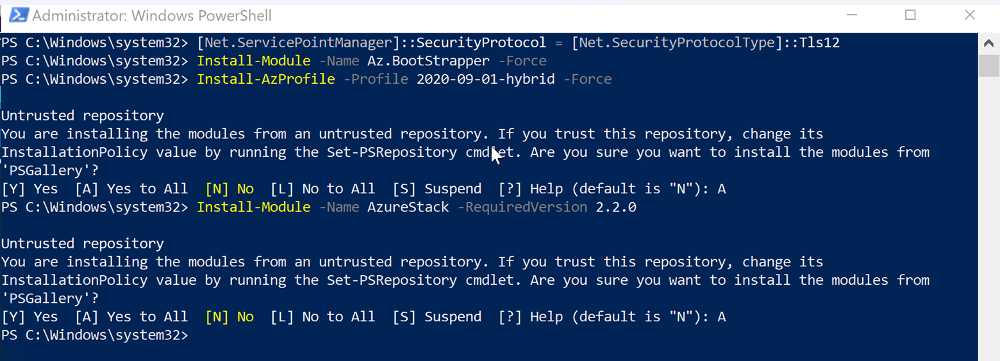

# Install Azure Stack Hub PowerShell Modules

To connect to Azure Stack Hub ARM endpoints and to perform certain Azure Stack Hub Operator functions, a specific set of PowerShell modules are required. Azure Stack Hub uses an older version of APIs compared to Azure Hyper-scale, so you must ensure that you are using the appropriate version.

## Prerequisites for Windows

To use Azure PowerShell in PowerShell 5.1 on Windows:

1. Update to Windows PowerShell 5.1 if needed. If you're on Windows 10, Windows Server 2016, or greater, you already have PowerShell 5.1 installed.

2. Install .NET Framework 4.7.2 or later.

3. Make sure you have the latest version of PowerShellGet. Run the following cmdlets from an elevated prompt:

```
[Net.ServicePointManager]::SecurityProtocol = [Net.SecurityProtocolType]::Tls12
```


```
Install-Module PowershellGet -MinimumVersion 2.2.3 -Force

Get-Module -ListAvailable | Where-Object {$_.Name -eq 'PowerShellGet'}
```


4. Close all PowerShell windows.


## Install Azure Stack Hub Modules Online

The Azure Stack Az module will work with PowerShell 5.1 or greater on a Windows machine, or PowerShell 6.x or greater on a Linux or macOS platform. Using the PowerShellGet cmdlets is the preferred installation method. This method works the same on the supported platforms.

1. Run the following command from an elevated PowerShell session:

```
[Net.ServicePointManager]::SecurityProtocol = [Net.SecurityProtocolType]::Tls12

Install-Module -Name Az.BootStrapper -Force

Install-AzProfile -Profile 2020-09-01-hybrid -Force

Install-Module -Name AzureStack -RequiredVersion 2.2.0
```

When asked if you would like to install from an untrusted repository, choose "A" for all.



## Download Azure Stack Hub tools from GitHub

AzureStack-Tools is a GitHub repository that hosts PowerShell modules for managing and deploying resources to Azure Stack Hub. If you're planning to establish VPN connectivity, you can download these PowerShell modules to the Azure Stack Development Kit (ASDK), or to a Windows-based external client.

1. To get these tools, clone the GitHub repository from the az branch or download the AzureStack-Tools folder by running the following script:

```
cd \

[Net.ServicePointManager]::SecurityProtocol = [Net.SecurityProtocolType]::Tls12

invoke-webrequest https://github.com/Azure/AzureStack-Tools/archive/az.zip -OutFile az.zip

expand-archive az.zip -DestinationPath "$env:ProgramFiles\WindowsPowerShell\Modules" -Force

Remove-Item az.zip
```


