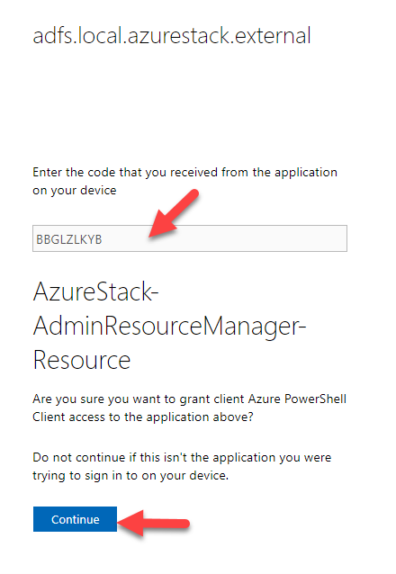

# Connect to Azure Resource Manager using PowerShell.

To connect to Azure Resource Manager (ARM) using PowerShell, you must be sure you have the correct modules installed, but you also need to ensure you have an Environment established. In this lab, you will learn how to setup your workstation so that it can connect to your Azure Stack Hub environment.

## Check your environment.

By default, the Azure PowerShell modules are aware of four Azure Environments, AzureCloud, AzureChinaCloud, AzureGermanCloud & AzureUSGovernment.

1. Open PowerShell and run the command Get-AzEnvironment.


You should see the four default environments listed. In the next steps, we will setup two more environments AzS-Admin and AzS-User.

As an operator, you will frequently connect to both environments to perform maintenance tasks. Your end-users will need to ability to connect to just the AzS-User environment to deploy, manage & maintain resources.

These environments are established in a per-user context. Meaning of user1 adds their environments to their workstation, user2 will not see them. User2 would need to setup their own environments. This also pertains to running an elevated PowerShell console and running as a standard user.

## Add AzS-Admin Environment

Each Azure Stack Hub in your Environment will need to have its own environment established in PowerShell. In order to run the next script, you will need to provide an Environment Name and the FQDN of your Azure Stack Hub.

1. Create a folder on the C: drive name Scripts. Download the following scripts and save them to C:\Scripts

To download the files, right click on the link and choose "Save Link As"

- [Add-AzureStackAdminEnvironment.ps1](https://raw.githubusercontent.com/RichShillingtonMSFT/Azure-Stack-Hub-Operator-Labs-ADFS/main/01-Operator%20Workstation/03-Connect%20to%20ARM%20using%20PowerShell/Add-AzureStackAdminEnvironment.ps1)

- [Add-AzureStackUserEnvironment.ps1](https://github.com/RichShillingtonMSFT/Azure-Stack-Hub-Operator-Labs-ADFS/blob/f52d2b9ea7f3e93841a68363a70211ef3a354685/01-Operator%20Workstation/03-Connect%20to%20ARM%20using%20PowerShell/Add-AzureStackUserEnvironment.ps1)

2. Open PowerShell and change the working directory to the scripts folder

```
CD C:\Scripts
```

3. Run the Add-AzureStackAdminEnvironment.ps1 script providing the answers to the parameters.

```
.\Add-AzureStackAdminEnvironment.ps1 -AdminEnvironmentName 'AzS-Admin' -AzureStackDomainFQDN 'local.azurestack.external'
```


1. When the script completes, run Get-AzEnvironment again and check to see that your new environment is listed.


## Add AzS-User Environment

The process to add the user environment is similar to what we just did for the Admin environment.

1. In the same PowerShell window, run Add-AzureStackUserEnvironment.ps1

```
.\Add-AzureStackUserEnvironment.ps1 -UserEnvironmentName 'AzS-User' -AzureStackDomainFQDN 'local.azurestack.external'
```

2. Check to make sure that your new AzS-User environment was added.


## Connect to AzS-Admin Environment using PowerShell**

Now that we have setup our Azure Stack environments, we can connect to them using PowerShell.

1. To connect to your AzS-Admin environment, In PowerShell run:

```
Connect-AzAccount -Environment 'AzS-Admin' -DeviceCode
```

2. Copy the URL and paste it in your Edge browser.


1. Next copy the code and paste it in the Code window, then click Continue.




2. Once you see that it is complete, you can go back to PowerShell.

3. If your login was successful, you should see your context displayed.


4. To connect to your User environment (AzS-User), you will need to change the command you just ran to specify the Environment. Give it a try and make sure you can connect.

**NOTE**: You can only be connected to one environment at a time. If you are working in multiple environments, you will need to have a separate PowerShell window for each.