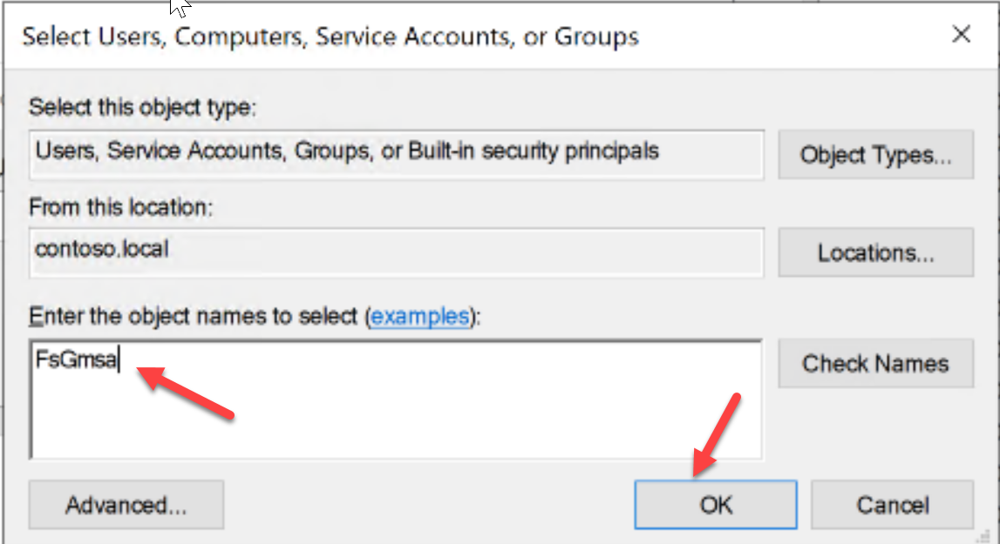
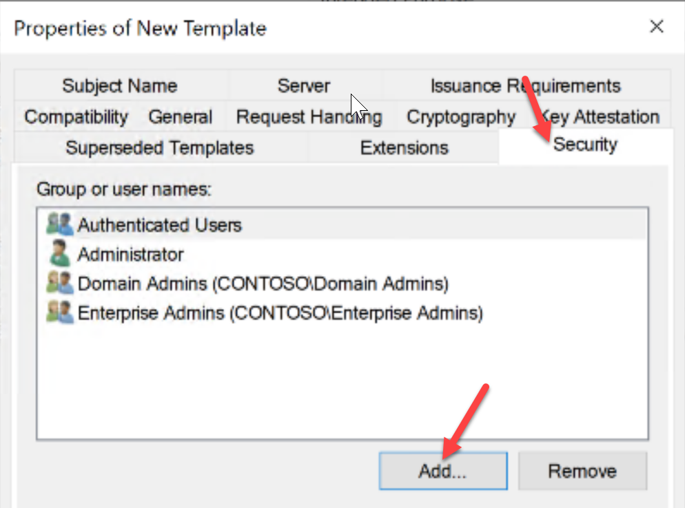
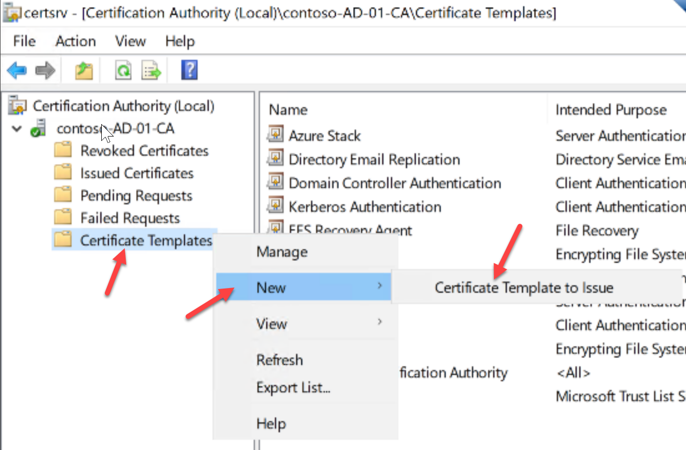
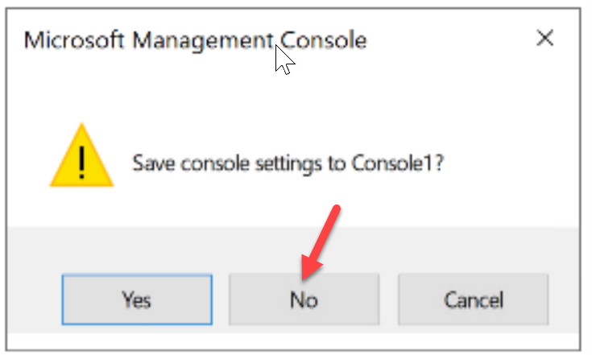

# Setup ADFS/Active Directory Identity Prerequisite Accounts & Certificates

1. Connect to your ASDK using the Remote Desktop Client. When prompted for Credentials use **AzureStack\AzureStackAdmin** for the username and the password supplied by the instructor.


2. If you see a Certificate Warning, click on **Don't ask me again** , then click **Yes**.


3. Once connected to the ASDK, open the Remote Desktop Client **inside of the ASDK** and **connect to the Domain Controller** AD-01 using its IP Address **10.100.100.10**.


4. When prompted for Credentials click **More Choices** , then **Use a different Account**. Use **Contoso\Administrator** for the username and enter the password supplied by the instructor.


5. If you see a Certificate Warning, click on **Don't ask me again** , then click **Yes**.


6. Click on the **Start Button (Windows Logo)** in the lower left and then click on **Windows Administrative Tools.**


7. Open Active Directory Users & Computers.


## Create a Service Admin User

The Service Admin User will be the first user added as an Operator of the Azure Stack Hub. This account will be referenced during the ADFS integration portion of the lab.

1. Expand **Contoso.local** , right click on **Users**. Navigate to **New** and click on **User**.


2. Fill out the fields for the Service Admin User then click **Next**.

**First name: Service
 Last name: Admin
 User logon name: serviceadmin**


3. In the Password box, **use the standard lab password that was provided to you**. **Uncheck User must change password at next logon** , **select Password never expires** , then click **Next**.


4. Click on **Finish.**


## Create Graph Service Account User

The Graph Service Account User is required to enable Active Directory Users & Groups lookups inside the Azure Stack Tenants. This account is crucial to assigning RBAC (Role Based Access Control) within tenant subscription. This account will be referenced during the ADFS integration portion of the lab.

1. Expand **Contoso.local** , right click on **Users**. Navigate to **New** and click on **User**.


2. Fill out the fields for the Graph Service Account User then click **Next**.

First name: Graph
Last name: Service
User logon name: ashgraph


3. In the Password box, **use the standard lab password that was provided to you**. **Uncheck User must change password at next logon** , **select Password never expires** , then click **Next**.


4. Click on **Finish.**


## Create ADFS Group Managed Service Account

The ADFS Service Group Managed Service Account is required when configuring ADFS. This account will be referenced during the ADFS setup portion of the lab. During the ADFS configuration there is an option to have the installer create one for you, however it is important that you know how to create one and ensure that it is configured to allow service login.

1. On AD-01, Click on Start and right click on Windows PowerShell.


2. Open an **elevated**** PowerShell session**. You can use PowerShell or PowerShell ISE.


3. Create a Group Managed Service Account using the script below:

```
Add-KdsRootKey –EffectiveTime (Get-Date).AddHours(-10);
New-ADServiceAccount FsGmsa -DNSHostName adfs.contoso.local -ServicePrincipalNames http/adfs.contoso.local
```


1. Next, we need to ensure that the new service account has permission to logon as a service, we need to configure Group Policy to allow it.

In **Administrative Tools** , open **Group Policy Management**.


2. Expand Forest: Contoso.local, Domains, and contoso.local. **Right click** on **Default Domain Policy** and click on **Edit**.


3. Expand Computer Configuration, Policies, Windows Settings, Security Settings, Local Policies, and click on User Rights Assignments. Double click on **Log on as a service**.


4. Click on **Define these policy settings** and click **Add User or Group**.


5. Click on Browse to add the GMSA we created in PowerShell.


6. Enter the name of the GMSA we created, then click Ok.



7. Click Ok on the next screen.


1. Repeat steps 4-7 to add "NT SERVICE\ALL SERVICES". **Do not click Browse** on step 5, just paste NT SERVICE\ALL SERVICES and click Ok.
**NOTE: This account is only to allow the Windows Internal Database service to login for the lab. In a Production environment, you would install WID first or use a SQL Server database.**

1. Verify the account is correct and click Ok. Close all remaining Group Policy Windows.


## Add ADFS DNS CName Record

In order to resolve our ADFS Farm name, we must create a DNS record that points to our ADFS server. By default, a record will be created for each computer object, however in a HA setup there would be more than one server. That record would normally point to a Load Balancer, but for this lab we will point to our single ADFS server.

1. On AD-01, in Administrative Tools, open the DNS Management Console.


2. Expand AD-01, Forward Lookup Zones. Right click on contoso.local and click on New alias (CNAME).


3. In the Alias name field, enter adfs. In the Fully qualified domain name field, enter the FQDN of our ADFS Server ADFS-01.contoso.local. Click Ok.


4. Close out of DNS Manager.

## Prepare ADFS Certificate Template

ADFS will require SSL Certificates for deployment and communication. These certificates can be requested from any trusted Certificate Authority, or you can use your own internal Certificate Authority.

**NOTE: You will need to connect to ADCS-01 (10.100.100.11) using RDP to perform this task.

1. In Administrative Tools, open Certificate Authority.


2. Expand Contoso-AD-01-CA, right click on Certificate Templates and click on Manage.


3. Locate the Web Server template, right click on it and select Duplicate Template.


4. Click on the General Tab and enter ADFS in the Template Display Name field.


5. Click on Request Handling tab and ensure that Allow private key to be exported is checked.


6. Click on the Security tab then click Add.



7. In Object Name box, type Domain Computers and then click Ok.


8. On the next screen, ensure that Domain Computers is selected. Ensure that the group has Enroll permission, then click Ok.


9. Close out of the Certificate Templates window.

10. Back on the Certificate Authority screen, right click on Certificate Templates. Select New and click on Certificate Template to Issue.



11. On the Enable Certificate Templates window, Click on ADFS and then Click Ok.


## Create ADFS Certificate Request and Submit it

Certificates play the most critical role in securing communications between federation servers, Web Application Proxies, claims-aware applications, and Web clients. The SSL certificate is used for securing communications between federation servers and clients.

1. Using RDP from the ASDK, connect to the ADFS server ADFS-01 by its IP Address 10.100.100.12 and login with Contoso\Administrator and the password supplied by the instructor.


2. Right click on the start button and click on Run


3. Type MMC and click Ok.


4. In the MMC console window, click on File and Add/Remove Snap-in.


5. Click on Certificates and click on Add.


6. Select **Computer Account** and click Next.


7. Click Finish on the next screen.


8. Click Ok.


9. Expand Certificates, Personal then right click on All Tasks and click on **Request New Certificate**.


10. Click Next on the Before You Being screen.


11. Ensure that **Active Directory Enrollment Policy** is selected and click **Next**.


12. Click on the **More Information is required link** under **ADFS**.


13. Under Subject name, under Type, select **Common name**. Enter **adfs.contoso.local** in the **value** field, then click **Add**.


14. Under **Alternative name** , under Type, **select DNS**. Enter **"adfs.contoso.local"** as the value, then click Add. Repeat this process using **"enterpriseregistration.contoso.local"** as the value.


15. Click on the General tab. In the **Friendly name field** , enter **adfs.contoso.local**.


16. Click on the **Private Key tab**. **Expand Key Options** and ensure that **Make private key exportable is checked**.


1. Back on the Request Certificates wizard page, ensure the checkbox for the ADFS template is checked and click Enroll. 


2. Click Finish.


## Prepare ADFS Certificate

During the ADFS installation, a PFX file will be required. This process will allow you to export the certificate including the private key as a PFX file. In this lab we are only using a single ADFS server and the enrolled certificate will be installed on, however in a production environment you would have multiple ADFS servers in your farm. The PFX file you export in this process would need to be imported on each ADFS server in your farm. See [install-the-new-ssl-certificate-on-each-federation-server-in-the-ad-fs-farm](https://learn.microsoft.com/en-us/previous-versions/windows/it-pro/windows-server-2012-R2-and-2012/dn781428(v=ws.11)%23install-the-new-ssl-certificate-on-each-federation-server-in-the-ad-fs-farm) for more details.

1. Locate the new certificate that was **enrolled using the ADFS template**. Right click on the certificate, select All Tasks and click **Export**.


2. Click Next on the Welcome screen.


3. On the next screen, ensure that **"Yes, export the private key"** is selected, then click **Next.**


1. On the next screen, ensure **.pfx** is selected, **"Include all certificates in the certification path if possible"** and " **Export all extended properties"** are **checked** and then click Next.


2. On the next screen, click Password and enter the lab password, confirm the password, then click Next.


3. On the File name screen, click Browse.


4. Select **Documents** for the location, use **adfs** for the file name, then click **Save**.


5. Click Next.


6. Click Finish.


7. Click Ok on the success screen, then close out of MMC. Choose No when prompted to save MMC.



