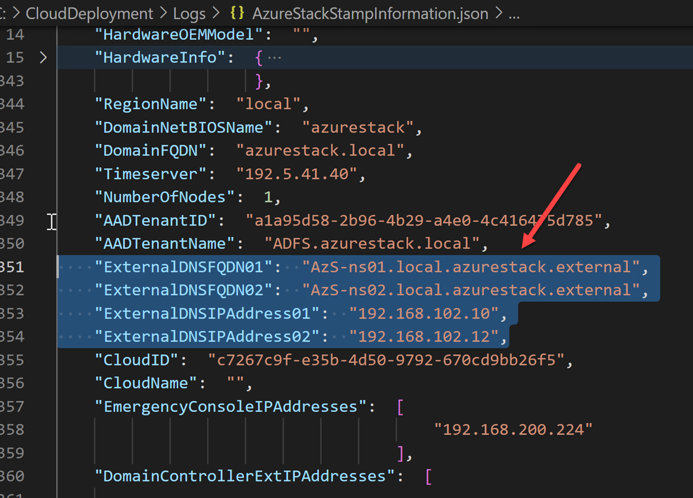
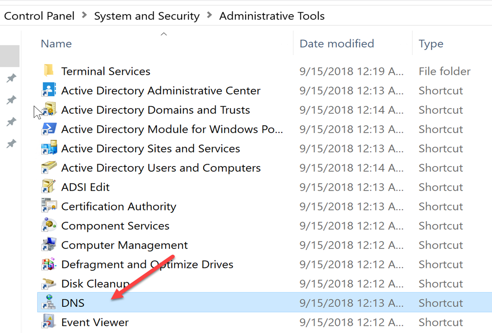
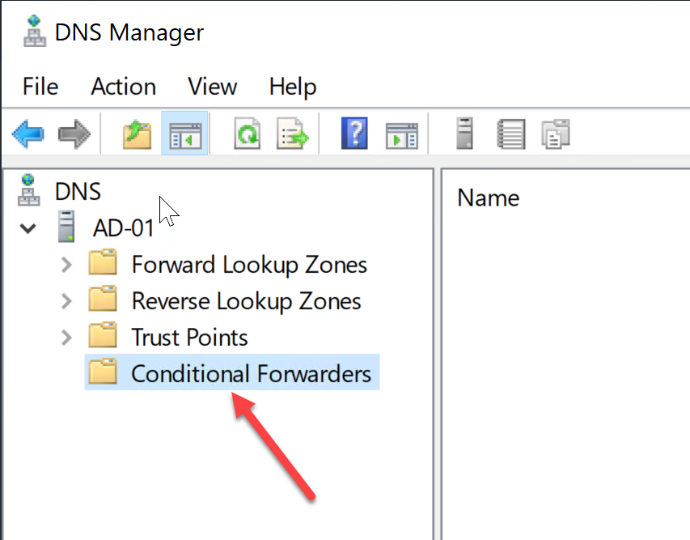
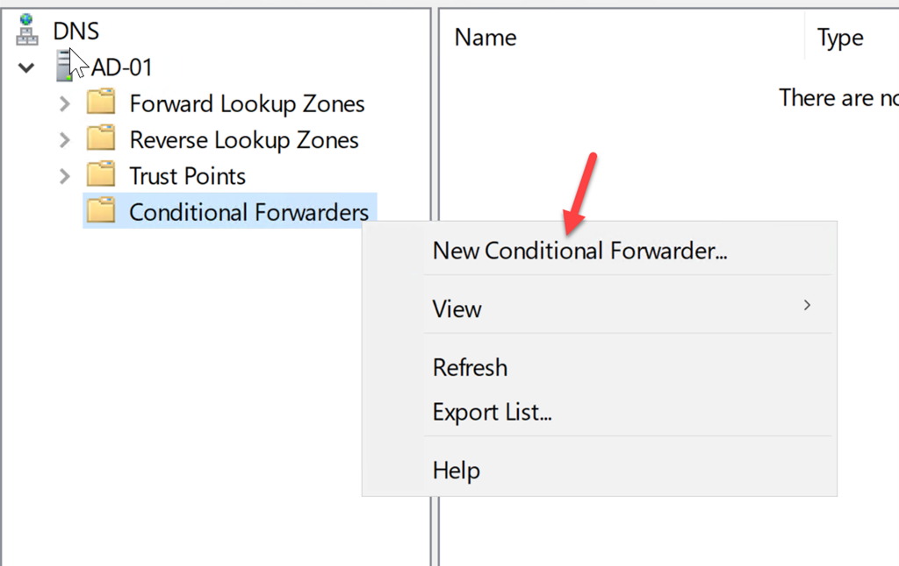
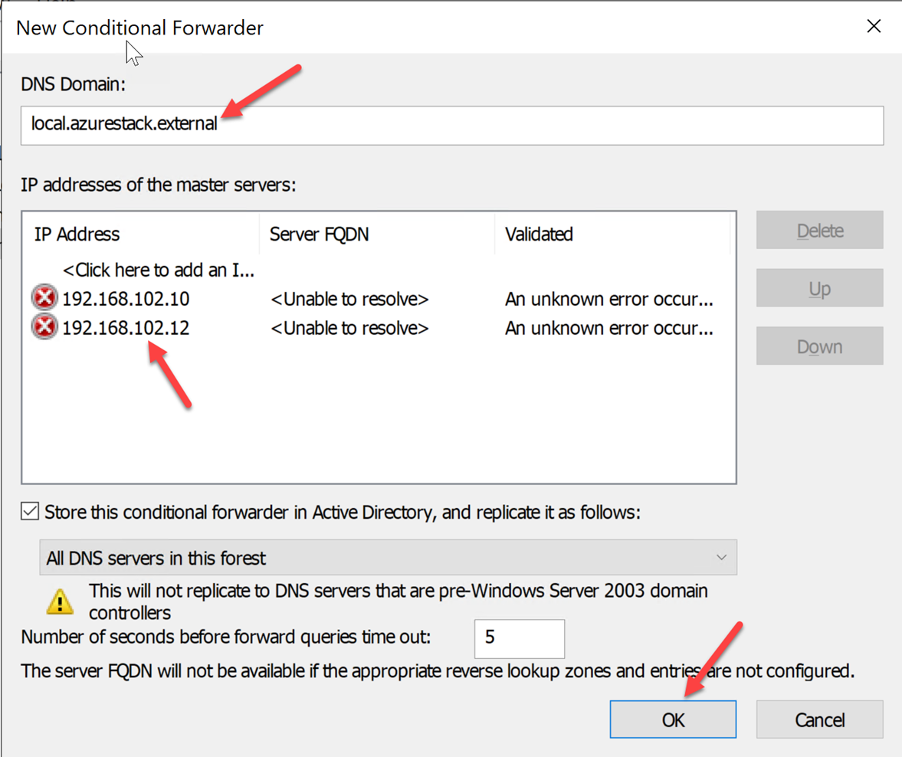
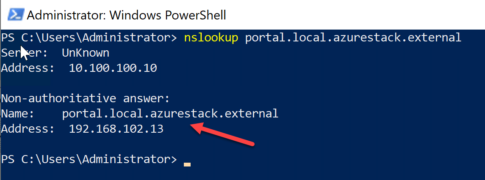

# Integrate Azure Stack DNS with On-Prem DNS
To be able to access Azure Stack Hub endpoints such as portal, adminportal, management, and adminmanagement from outside Azure Stack Hub, you need to integrate the Azure Stack Hub DNS services with the DNS servers that host the DNS zones you want to use in Azure Stack Hub.

***

## Resolving Azure Stack Hub DNS names from outside Azure Stack Hub

To integrate your Azure Stack Hub deployment with your DNS infrastructure, you need the following information:

- DNS server FQDNs
- DNS server IP addresses

The FQDNs for the Azure Stack Hub DNS servers have the following format:

- [NAMINGPREFIX]-ns01.[REGION].[EXTERNALDOMAINNAME]
- [NAMINGPREFIX]-ns02.[REGION].[EXTERNALDOMAINNAME]

When the deployment is completed, the technician will generally give you a file named AzureStackStampInformation.json.
This file contains several important pieces of information including the IP Addresses of the Privileged Endpoints, Domain Names, Endpoint URLs and also the DNS Server information required for this step.
If you do not have this information, you can usually find a copy on your HLH or ASDK machine in C:\CloudDeployment\Logs

1.	Open the AzureStackStampInformation.json and locate the information above.

1. Connect to AD-01 (10.100.100.10) using RDP. Open DNS Manager. To open DNS Manager, click Start, point to Administrative Tools, and then click DNS.

3.	In the console tree, Expand the DNS server AD-01.

4.	In the console tree, right click Conditional Forwarders, and then on the Action menu, click New conditional forwarder.

5.	In DNS domain, type the fully qualified domain name (FQDN) “local.azurestack.external”.

6.	Add both IP addresses of the Azure Stacks DNS servers from your AzureStackStampInformation.json, then click Ok

7.	Open a PowerShell or Command Prompt window and type 
“nslookup portal.local.azurestack.external” then hit Enter. You should see a Non-authoritative answer.

