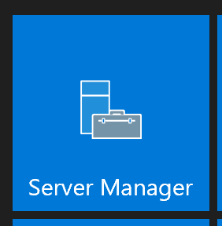

# Install ADFS.

To Integrate Azure Stack Hub internal ADFS with your Active Directory you will need to install ADFS and prepare it to work with Azure Stack Hub.

## **Add ADFS Roles & Features**

A Windows Server has been deployed for you to use for the ADFS Role. The server's name is ADFS-01 with an IP address of 10.100.100.11.

1. From your **ASDK** , connect to **ADFS-01** using **RDP** with its IP address **10.100.100.11**.

2. Click the **Start button** and click on **Server manager**.

 

1. When Server Manager has finished loading, click on **Add roles and features**.

 

4. On the Before you begin page, click **Next**.

 

5. On the Select Installation type page, ensure the **Role-based or feature-based installation** is selected, then click **Next**.

 

6. On the Select destination server page, ensure that **ADFS-01** is selected and click **Next**.

 

7. On the Select server roles page, **select Active Directory Federation Services** and click **Next**.

 

8. On the Select features page, click **Next**.

 

9. On the Active Directory Federation Services page, click **Next**.

 

10. On the Confirm installation selections page, **click on Restart the destination server if required** , click **Yes on the popup confirmation** box, then click **Install**.

 

11. When the Install is complete if the server did not restart automatically, **restart the server before proceeding**.

# **Active Directory Federation Services Configuration**

Now that ADFS has been installed, we need to configure the ADFS Role.

1. When the server has restarted, log back in and open Server Manager. When Server Manager finishes loading, click on the **exclamation point** in the upper right, then click on the **Configure the federation service link.**
 

2. On the Welcome page, ensure the **Create the first federation server in a federation server farm** is selected and click **Next**.

 

3. On the Connect to Active Directory Domain Service page, click **Next**.

 

4. On Specify Service Properties page, click the drop down to **select the adfs.contoso.local SSL certificate**. Enter **adfs.contoso.local for the Federation Service Name** and enter a **Federation Service display name like Contoso Corp**. Click **Next**.
 

5. On the Specify Service Account page, click **Select** to search for the ADFS Service account.

 

6. When the User search box appears, type **FsGmsa** in the object name box, click **Check Names** , then click **Ok**.

 

7. Back on Specify Service Account screen, click **Next**.

 

8. On the Specify Configuration Database page, ensure **Create a database on this server using Windows Internal Database** is selected, then click **Next**.

 

9. On the Review Options screen, verify you have everything configured properly, then click **Next**.

 

10. When the Pre-requisites checks are complete, click **Configure**.

 

11. Once the install is complete, click Close.

 