# Integrate ADFS with Azure Stack Hub

Now that we have deployed and configured all the prerequisite accounts and applications, we can begin the process of using our own Active Directory as our identity provider.

# Trigger automation to configure graph

For this procedure, use a computer in your datacenter network that can communicate with the privileged endpoint in Azure Stack Hub. In our lab, we will use our Domain Controller.

1. Connect to AD-01 (10.100.100.10) using RDP.

2. Locate the IP Address of your Privileged Enpoint in your AzureStackStampInformation.json file.

3. Open an elevated PowerShell window and run the following commands to create a PowerShell remoting session to the Privileged Endpoint. You will need to replace "IP Address of PEP" with the IP of your Privileged Endpoint

```
$PEPCredentials = Get-Credential

$PEPSession = New-PSSession -ComputerName 'IP Address of PEP' -ConfigurationName PrivilegedEndpoint -Credential $PEPCredentials -SessionOption (New-PSSessionOption -Culture en-US -UICulture en-US)
```

4. When prompted for credentials, use AzureStack\CloudAdmin as the username and the lab password, then click Ok.

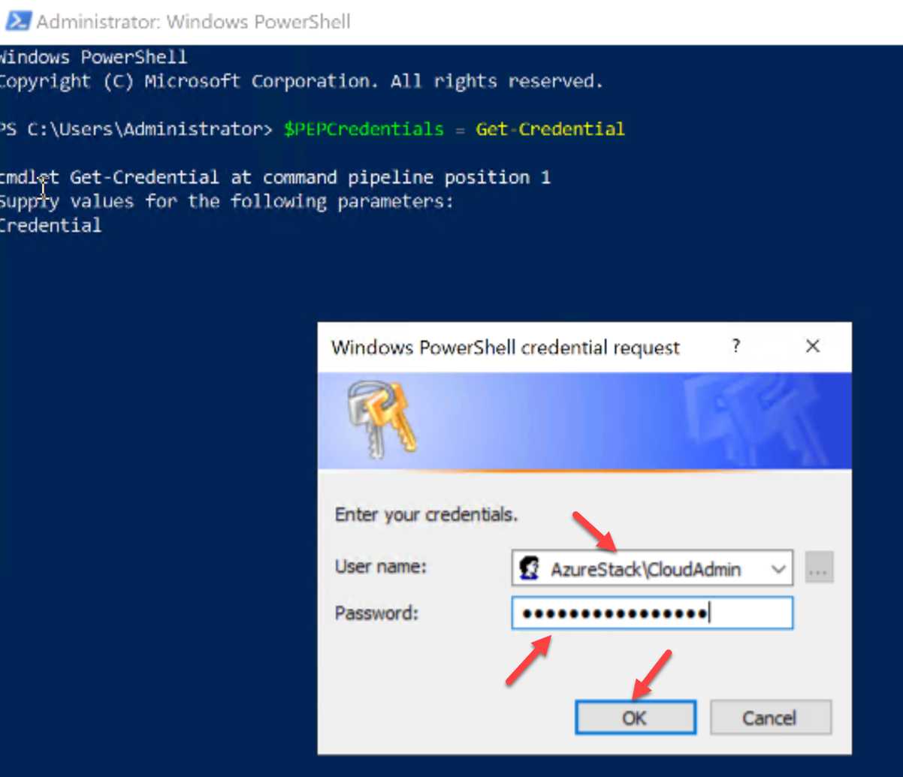


5. The error below will appear in the PowerShell window.

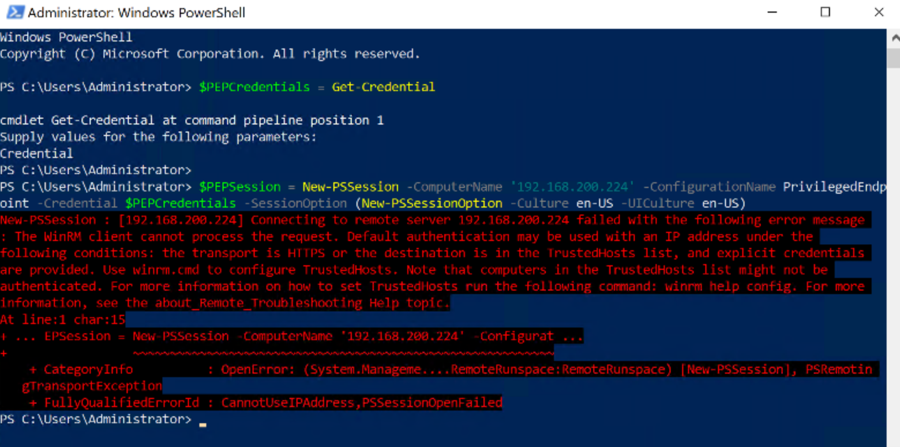

Communicating with the Privileged Endpoint or (PEP) uses WinRM and PSRemoting. In order to successfully connect to another computer, you must make sure WinRM is enabled and the remote computer is added to the trusted list.

1. To enable WinRM, run the command "winrm quickconfig". You should see a message that it already enabled, but this may not be the case in your environment.

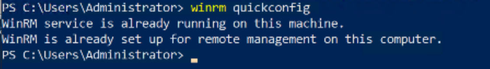


2. Next we need to add the PEP IP Address to our trusted hosts. To do that run this command in the PowerShell window.

Add the IP of your PEP to the code below.

```
winrm set winrm/config/client '@{TrustedHosts="IP Address of PEP"}'
```

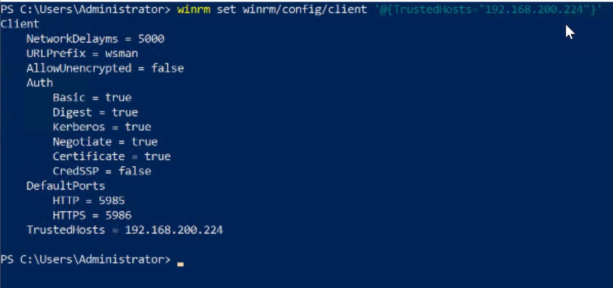

3. Now that we trust the PEP, we can re-run the PSSession command. We do not need to re-run the credential command as the credential is still saved.

```
$PEPSession = New-PSSession -ComputerName 'IP Address of PEP' -ConfigurationName PrivilegedEndpoint -Credential $PEPCredentials -SessionOption (New-PSSessionOption -Culture en-US -UICulture en-US)
```

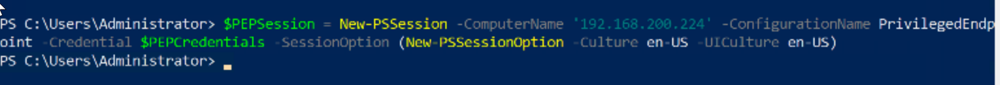


4. We now have a PowerShell Remote session stored in the $PEPSession variable. We can send commands from our local PowerShell session to be run on the remote computer.


5. To trigger graph automation, you will need the credentials for the graph service account we created in a prior lab. Run the following script providing the graph credentials when prompted, then click Ok.

```
 $i = @(
 [pscustomobject]@{
 CustomADGlobalCatalog="contoso.local"
 CustomADAdminCredential= Get-Credential
 SkipRootDomainValidation = $true
 ValidateParameters = $true
 Force = $true
 })

Invoke-Command -Session $PEPSession -ScriptBlock {Register-DirectoryService -customCatalog $using:i}
```

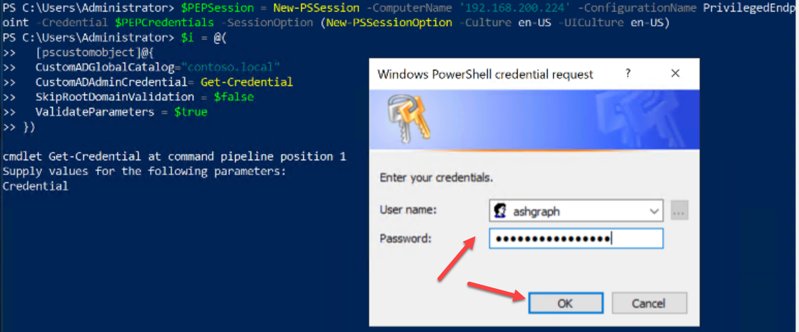

1. Verify that the command completed successfully.

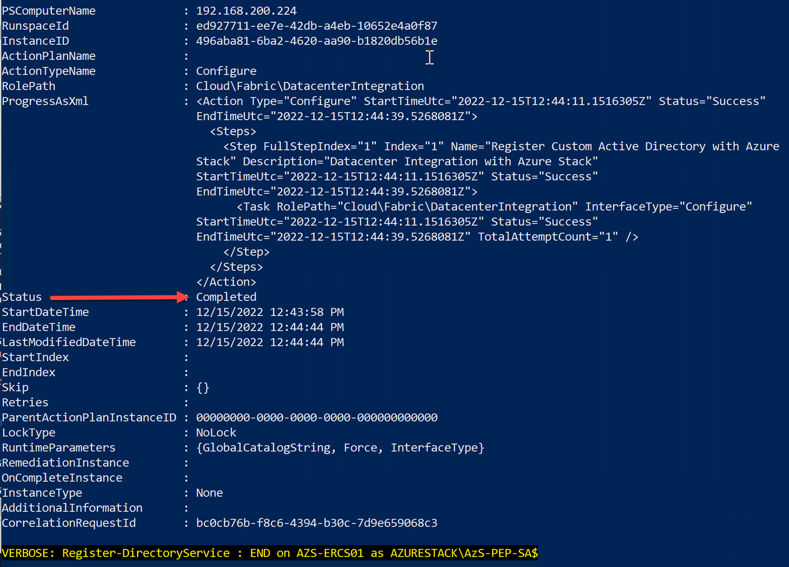

## Trigger automation to configure claims provider trust in Azure Stack Hub

For this procedure, use a computer that can communicate with the privileged endpoint in Azure Stack Hub. It's expected that the certificate used by the account STS AD FS is trusted by Azure Stack Hub.

1. Run the command below to invoke a command on your PEP Session:

```
Invoke-Command -Session $PEPSession -ScriptBlock {Register-CustomAdfs -CustomAdfsName Contoso -CustomADFSFederationMetadataEndpointUri 'https://adfs.contoso.local/federationmetadata/2007-06/federationmetadata.xml'}
```

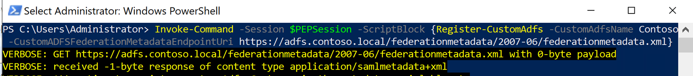


2. Validate that the command completed successfully.

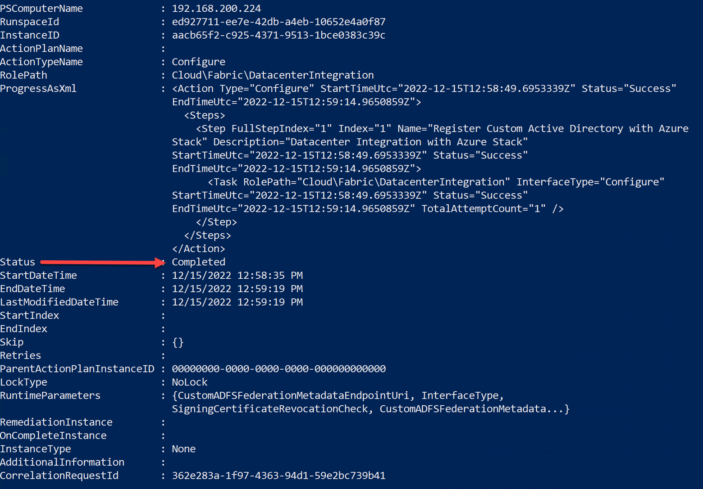

3. Now we must set the Service Admin account. This is the first account that will have permissions to the Azure Stack Hub Default Provider Subscription. You must run the below command on the PEP using Invoke command. Build the correct command structure and run:

```
Set-ServiceAdminOwner -ServiceAdminOwnerUpn "Your Service Admin Account Full UPN"
```

4. Verify that the previous command ran successfully.

## Configure relying party on existing AD FS deployment

1. Connect to the Contoso ADFS server (10.100.100.11) using RDP.

2. Copy the following content into a .txt file. Save the file as c:\ClaimIssuanceRules.txt on your datacenter's ADFS Server:

```
@RuleTemplate = "LdapClaims"
@RuleName = "Name claim"
c:[Type == "http://schemas.microsoft.com/ws/2008/06/identity/claims/windowsaccountname", Issuer == "AD AUTHORITY"]
=> issue(store = "Active Directory", types = ("http://schemas.xmlsoap.org/ws/2005/05/identity/claims/name"), query = ";userPrincipalName;{0}", param = c.Value);

@RuleTemplate = "LdapClaims"
@RuleName = "UPN claim"
c:[Type == "http://schemas.microsoft.com/ws/2008/06/identity/claims/windowsaccountname", Issuer == "AD AUTHORITY"]
=> issue(store = "Active Directory", types = ("http://schemas.xmlsoap.org/ws/2005/05/identity/claims/upn"), query = ";userPrincipalName;{0}", param = c.Value);

@RuleTemplate = "LdapClaims"
@RuleName = "ObjectID claim"
c:[Type == "http://schemas.microsoft.com/ws/2008/06/identity/claims/primarysid"]
=> issue(Type = "http://schemas.microsoft.com/identity/claims/objectidentifier", Issuer = c.Issuer, OriginalIssuer = c.OriginalIssuer, Value = c.Value, ValueType = c.ValueType);

@RuleName = "Family Name and Given claim"
c:[Type == "http://schemas.microsoft.com/ws/2008/06/identity/claims/windowsaccountname", Issuer == "AD AUTHORITY"]
=> issue(store = "Active Directory", types = ("http://schemas.xmlsoap.org/ws/2005/05/identity/claims/surname", "http://schemas.xmlsoap.org/ws/2005/05/identity/claims/givenname"), query = ";sn,givenName;{0}", param = c.Value);

@RuleTemplate = "PassThroughClaims"
@RuleName = "Pass through all Group SID claims"
c:[Type == "http://schemas.microsoft.com/ws/2008/06/identity/claims/groupsid", Issuer =~ "^(AD AUTHORITY|SELF AUTHORITY|LOCAL AUTHORITY)$"]
=> issue(claim = c);

@RuleTemplate = "PassThroughClaims"
@RuleName = "Pass through all windows account name claims"
c:[Type == "http://schemas.microsoft.com/ws/2008/06/identity/claims/windowsaccountname"]
=> issue(claim = c);
```


3. Open an elevated PowerShell session.

4. Validate that Windows Forms-based authentication for extranet and intranet is enabled. You can check if its already enabled by running the following cmdlet:

```
 Get-AdfsAuthenticationProvider | where-object { $\_.name -eq "FormsAuthentication" } | select Name, AllowedForPrimaryExtranet, AllowedForPrimaryIntranet
```

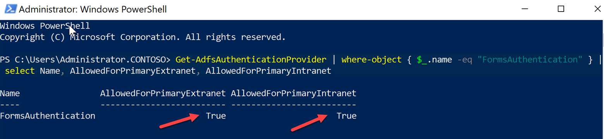


5. Run the following command to add the Relying Party Trust to your ADFS.

```
Add-ADFSRelyingPartyTrust -Name AzureStack -MetadataUrl 'https://adfs.local.azurestack.external/FederationMetadata/2007-06/FederationMetadata.xml' -IssuanceTransformRulesFile 'C:\ClaimIssuanceRules.txt' -AutoUpdateEnabled:$true -MonitoringEnabled:$true -enabled:$true -AccessControlPolicyName 'Permit everyone' -TokenLifeTime 1440
```

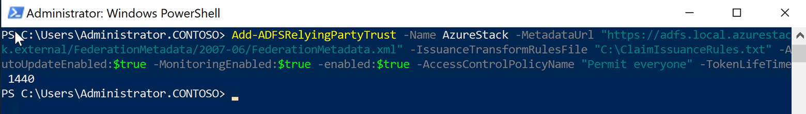

6. When you use Internet Explorer or the Microsoft Edge browser to access Azure Stack Hub, you must ignore token bindings. Otherwise, the sign-in attempts fail. On your ADFS server, run the following command:

```
 Set-AdfsProperties -IgnoreTokenBinding $true
```

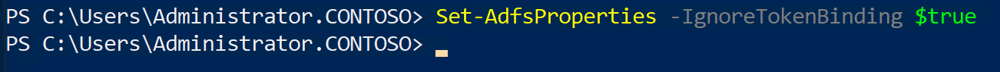


**_NOTE:_** This step isn't applicable when using Windows Server 2012 or 2012 R2 AD FS. In that case, it's safe to skip this command and continue with the integration.


# Test our work

Now we can test our configuration and verify that we are able to login.

1. On your ASDK, open the Edge Browser and navigate to: [https://adminportal.local.azurestack.external](https://adminportal.local.azurestack.external/)


2. You should see your ADFS login Contoso Corp. Login with the Service Admin Account credentials.

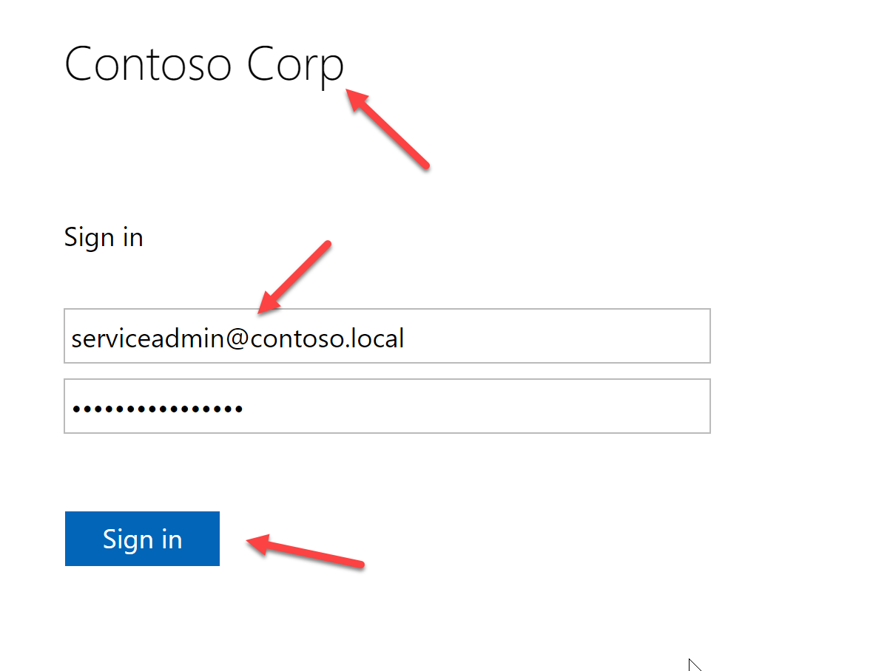