# Assign Hub Operators

Before a user can access the Azure Stack Hub Administrator Portal, they must added as an operator. It is a good practice to assign Azure permissions to groups instead of individual users. This allows for ease of control with regards to account lifecycle management.

The Azure Stack Hub Administrator Portal contains a subscription called "Default Provider Subscription". Users or groups assigned the Owner role on this subscription become operators of the Azure Stack Hub.

## Create an ASH Operators group in Active Directory

We need to create a security group in active directory and add the users we want to be operators to this group. To use your local active directory groups for access control assignment in Azure Stack Hub, they **MUST** be a **Universal group**.

1. Connect to your domain controller AD-01 using RDP.

2. In Administrative Tools, open Active Directory Users and Computers.

3. Right click on Users. Select New and then Group.

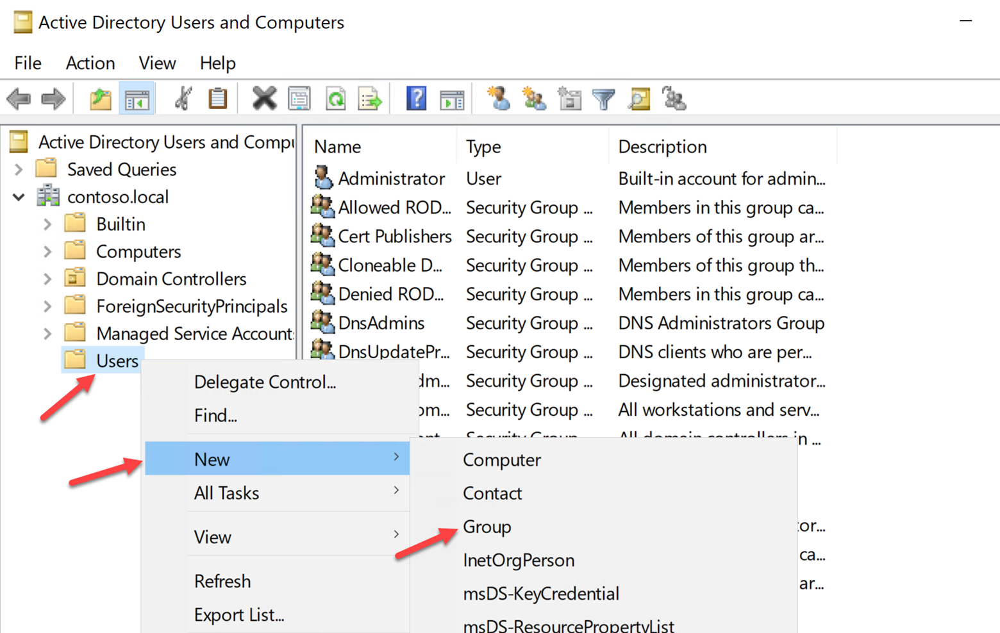

4. Name the group ASH Operators. Ensure that Universal is selected for the Group Scope, then click Ok.

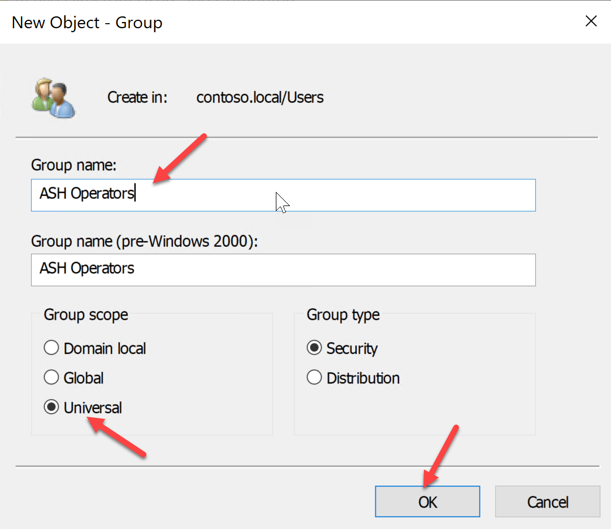

5. Double click on our new group and go to the members tab, then click Add.

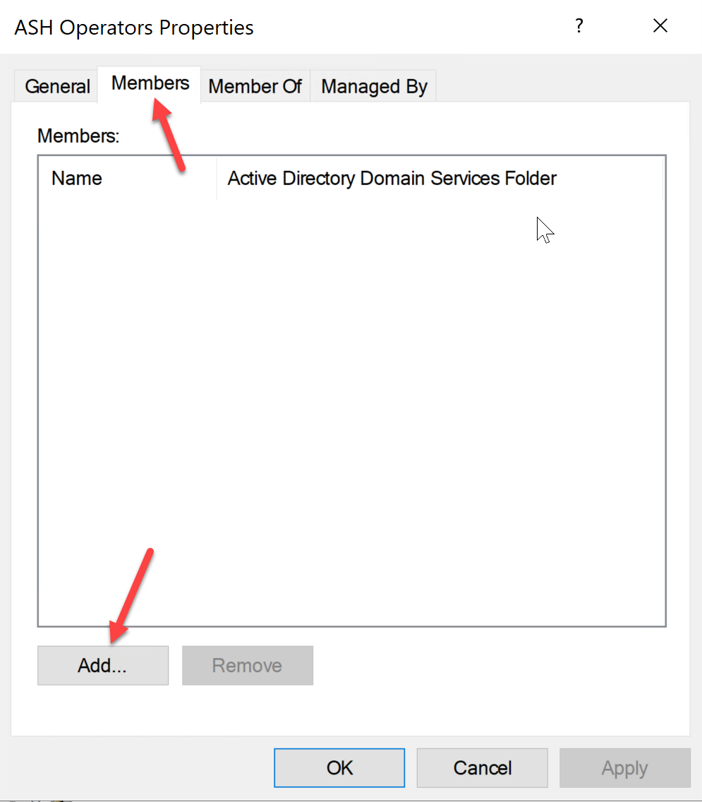

6. In Object name field, type Administrator. Click on Check Names, then click on Ok.

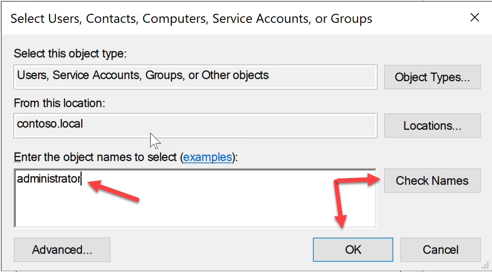

7. Click Ok to close the group properties screen.

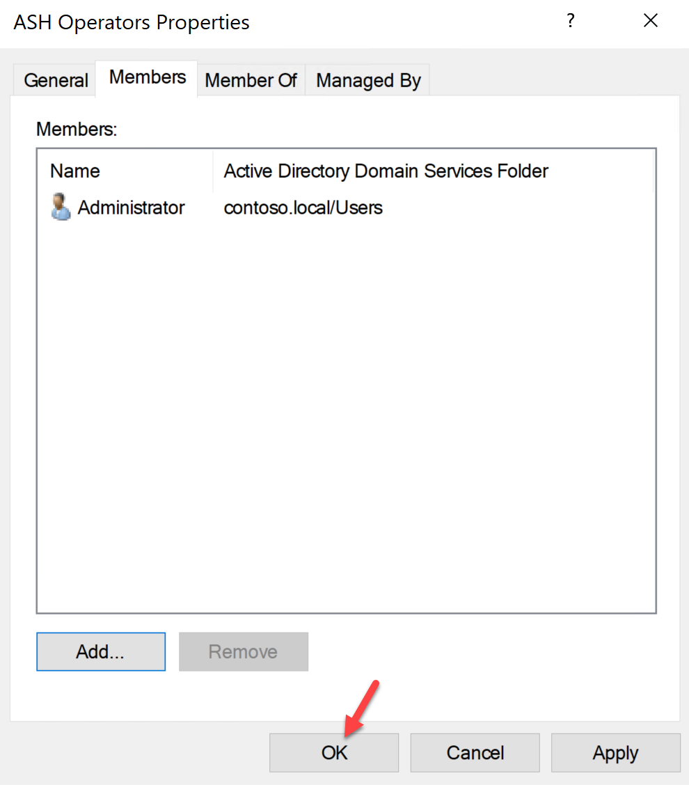

# **Grant ASH Operators Group Permission in Azure Stack Hub.**

1. From the ASDK, login to your Azure Stack Hub Admin Portal [https://adminportal.local.azurestack.external](https://adminportal.local.azurestack.external/) using the Service Admin account.

2. In the left blade, click on All Services. The click on Subscription in the right blade.

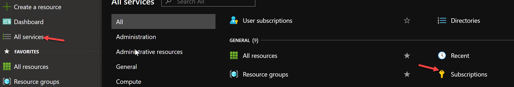

3. Click on Default Provider Subscription.

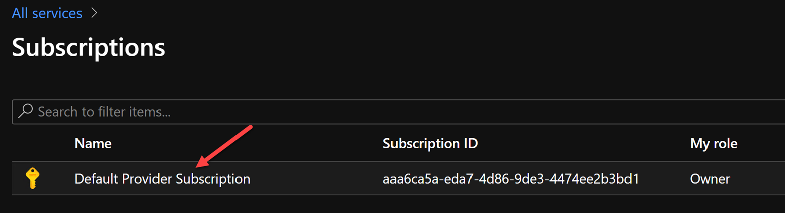

4. In the subscription blade, click on Access control (IAM).

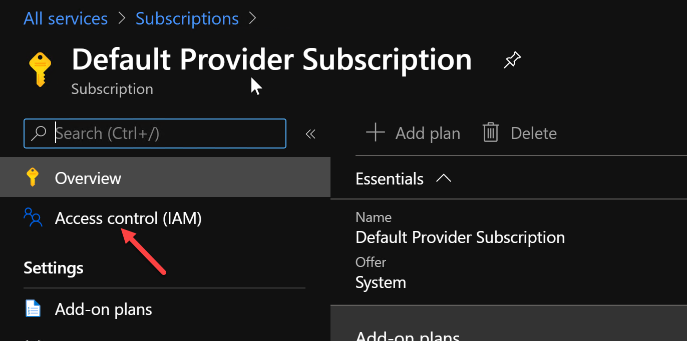

5. Click on Add, then Add role assignment.

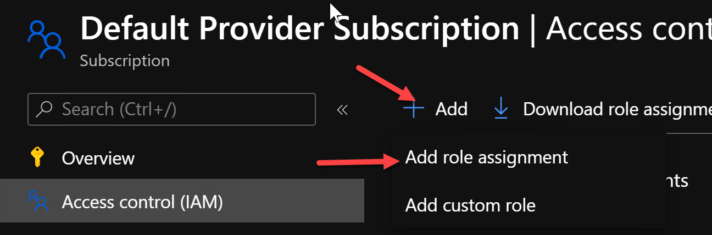

6. Select Owner for the Role. Search for ASH Operators group in the select box, then click Save.

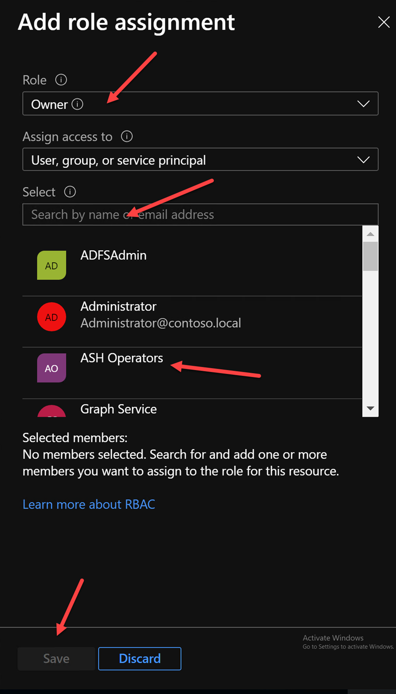

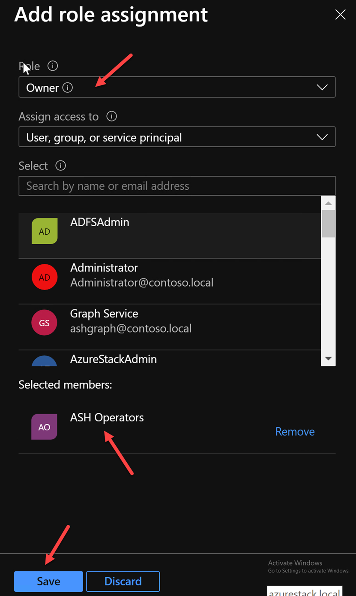

7. Close all Edge browser windows.

8. Open a new Edge browser window and navigate to the Admin Portal.

9. At the login prompt, login with you Administrator account credentials.

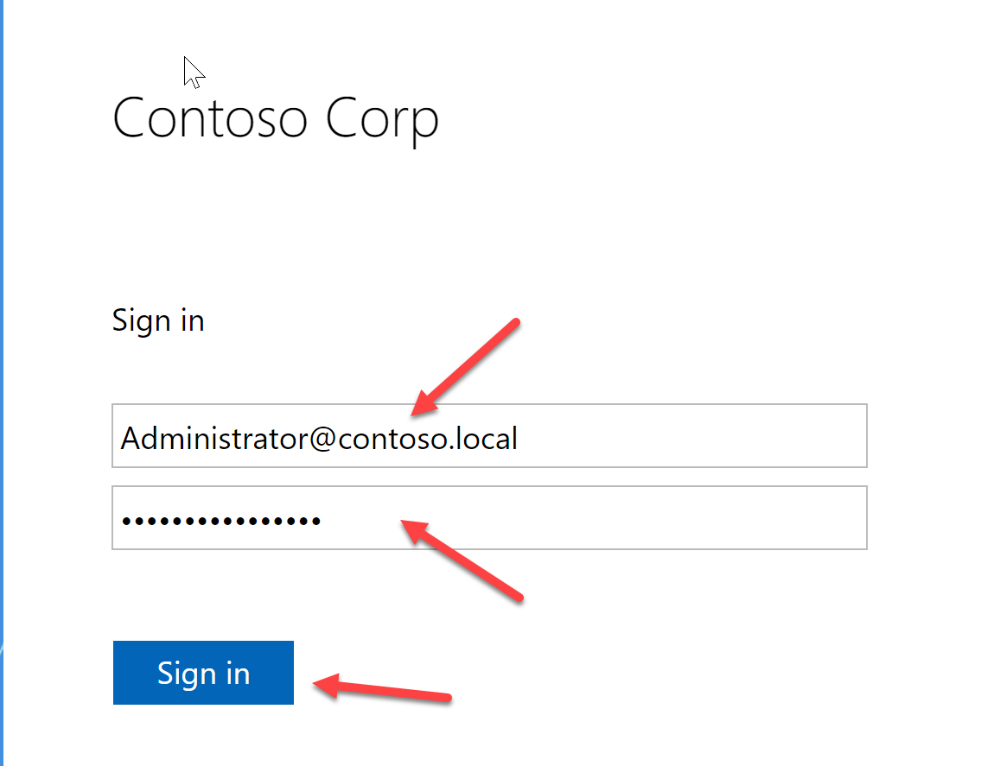

Your Administrator account is now an Azure Stack Hub Operator. The Service Admin account should be use only in an emergency and should also be disabled when not in use.