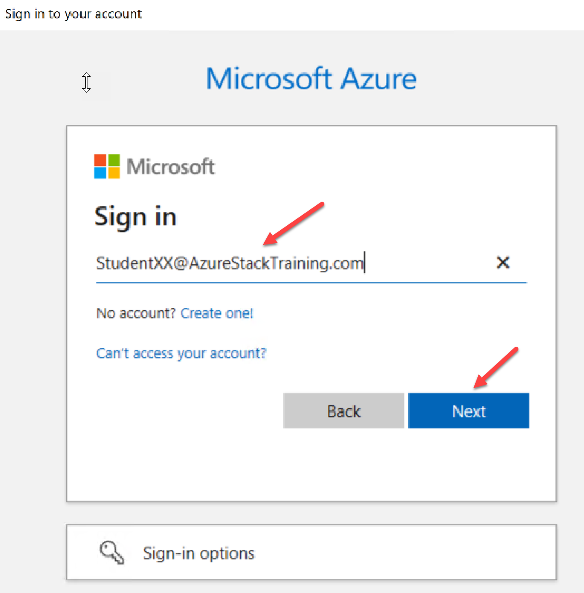
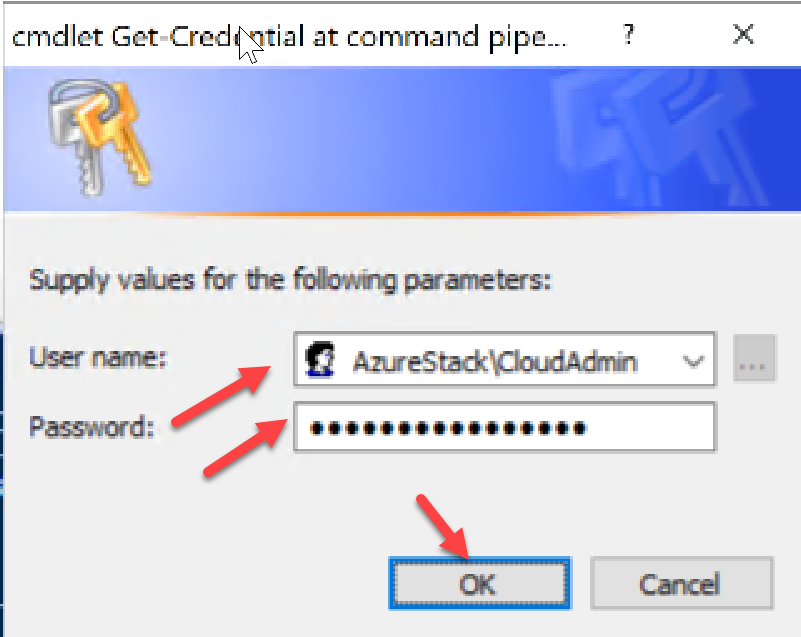
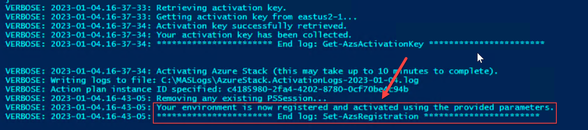

# Register Azure Stack Hub with Azure.

You must register Azure Stack Hub with Azure so you can download Azure Marketplace items from Azure and set up commerce data reporting back to Microsoft. After you register Azure Stack Hub, usage is reported to Azure commerce and you can see it under the Azure billing Subscription ID used for registration.

 Registration is required to support full Azure Stack Hub functionality, including offering items in the marketplace. You'll be in violation of Azure Stack Hub licensing terms if you don't register when using the pay-as-you-use billing model.

## Perform an Online Registration with Azure

1. To register the Azure Stack Hub resource provider with Azure, start PowerShell ISE as an administrator and use the following PowerShell cmdlets with the EnvironmentName parameter set to the appropriate Azure subscription Environment. For this exercise we will be registering our ASDK in **Azure Cloud**. **Replace "<environment name>" in the command below with the appropriate name for the Azure Cloud Environment.

**HINT** : If you need to find the name you can use Get-AzEnvironment to see the list.

 Connect-AzAccount -EnvironmentName "<environment name>"


2. When prompted for credentials, use your student Azure Active Directory account (StudentXX@azurestacktraining.com) and the lab password.



 **NOTE** : Once connected, If you have multiple subscriptions, run the following command to select the one you want to use:
 ```
 Get-AzSubscription -SubscriptionID '\<Your Azure Subscription GUID\>' | Select-AzSubscription
```

3. Run the following command to register the Azure Stack Hub resource provider in your Azure subscription:

```
 Register-AzResourceProvider -ProviderNamespace Microsoft.AzureStack
```

4. We must import the PowerShell module included with the Azure Stack Tools in order to run the registration cmdlets. Run the following command to import the module.

```
 Import-Module 'C:\Program Files\WindowsPowerShell\Modules\AzureStack-Tools-az\Registration\RegisterWithAzure.psm1'
```

5. For the next step we will perform an online registration with Azure to a subscription located in East US. You will need to add the IP address of your PEP prior to running these commands.

```
 $PrivilegedEndpoint = 'IP Address of PEP'

$CloudAdminCredential = Get-Credential

$Location = 'eastus'

$AzContext = Get-AzContext

```

```
Set-AzsRegistration -PrivilegedEndpointCredential $CloudAdminCredential `
 -PrivilegedEndpoint $PrivilegedEndpoint `
 -RegistrationName $env:COMPUTERNAME -BillingModel Development `
 -ResourceGroupLocation $Location `
 -UsageReportingEnabled `
 -MarketplaceSyndicationEnabled `
 -AzureContext $AzContext -Verbose
```

 When prompted for credentials, enter your cloud admin credentials.



The registration process takes approximately 10 minutes. When it is complete, you should see a message similar to this:

