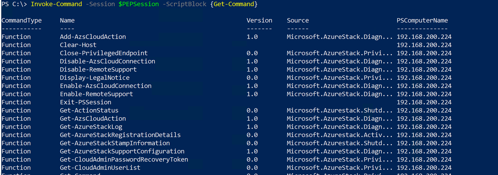
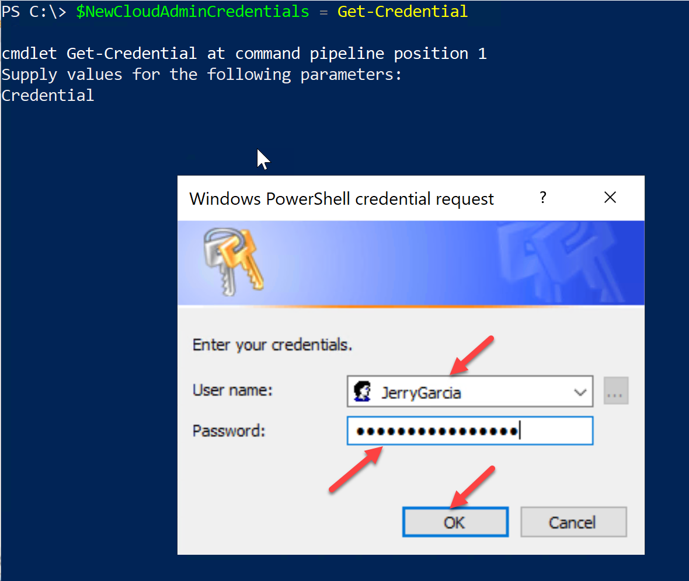
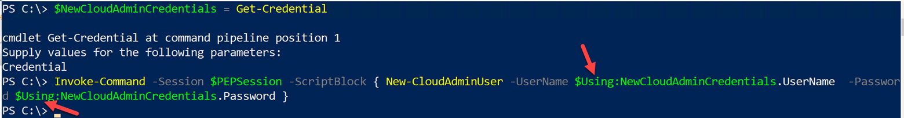
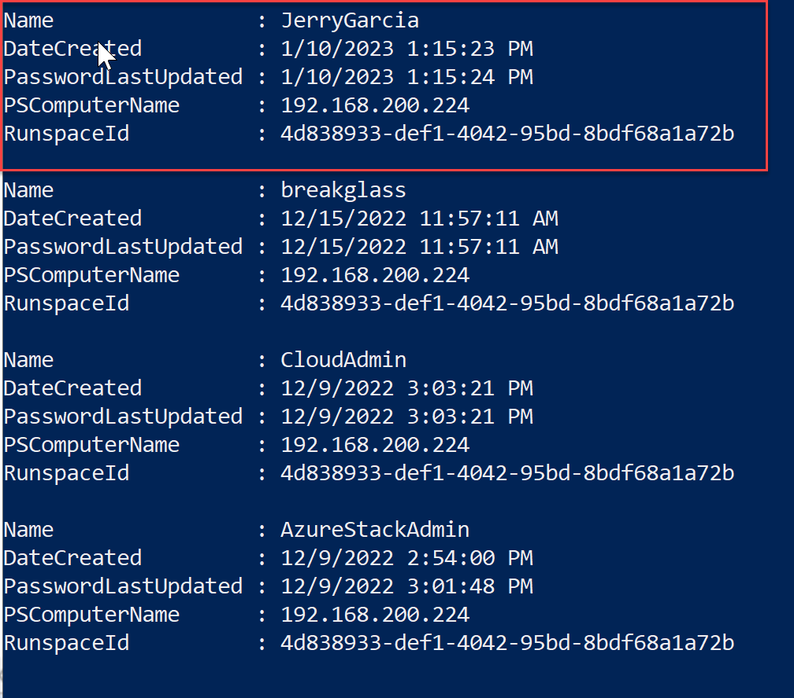

# Create Cloud Admin Account

When Azure Stack is deployed, an account know as Cloud Admin is created. This account is used to connect to the Privileged Endpoints (PEPs) to perform maintenance and configuration tasks. It is important to ensure you retain the ability to connect to the PEPs by creating a secondary Cloud Admin account for emergency use. Depending on the number of operators, some customers prefer that each operator has their own Cloud Admin account to perform administrative actions. The steps below will walk you through creating a new Cloud Admin account.

## Create a second Cloud Admin account

For this lab, you will be connecting to the PEP. You can use the previous lab See LabFiles\01-Operator Workstation\02-Azure Stack Hub privileged endpoint\01 - Connect to Privileged Endpoint for reference.

1. Connect to the Privileged Endpoint using PowerShell remoting as AzureStack\CloudAdmin storing the connection in $PEPSession variable.


2. Using Invoke-Command, pull a list of the PEP commands available to you. See if you can find the command used to create a new Cloud Admin account in the output.

```
 Invoke-Command -Session $PEPSession -ScriptBlock {Get-Command}
```



1. Now that you have found the command, we need to create a PowerShell credential object to use for your new Cloud Admin account. When prompted provide any username you would like and supply the lab password in the password field, then click Ok.

```
$NewCloudAdminCredentials = Get-Credential
```




4. Now that we have a credential object, we in our local PowerShell session, we need to pass its contents to our remote session. To reference local objects in a remote session, you must use $Using: before the variable name. This tells PowerShell to take these objects from the local session to the remote session.

```
Invoke-Command -Session $PEPSession -ScriptBlock { PUTCOMMANDHERE -UserName $Using:NewCloudAdminCredentials.UserName -Password $Using:NewCloudAdminCredentials.Password }
```



5. Once the new Cloud Admin account is created, use Invoke-Command to run Get-Command to pull the command list again. See if you can find the command to get a list of Cloud Admin user accounts. Once you have found that, run the command in a Invoke-Command script block to pull a list of Cloud Admins. You should see the new account you created in the list.

