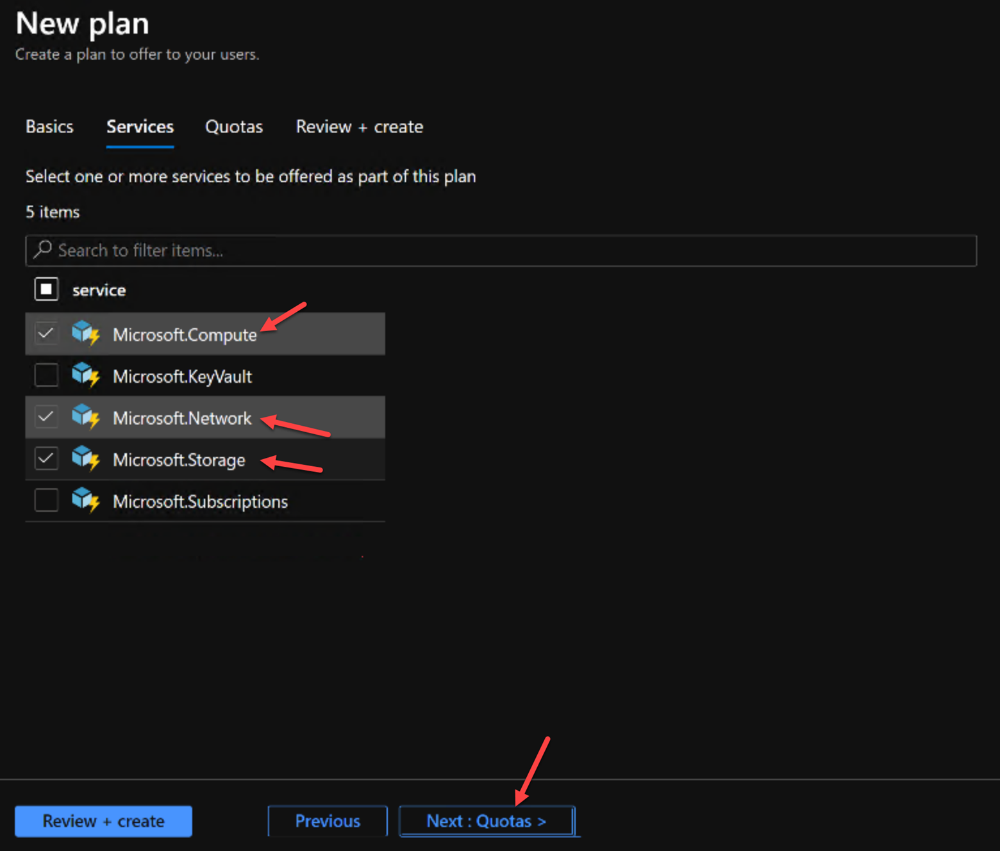

# Offers, Plans, Quotas & a subscription

Using quotas, plans, and offers, the Operator is building a capacity management practice by balancing what is available to the users, while at the same time needs to ensure enough capacity is present for future workloads. In the next exercise we will:

- Gain experience with creating quotas, plans, offers and user subscriptions

## Create Offers, Plans, Quotas & a subscription

1. Open the  **Azure Stack Admin Portal**  link and login using the **administrator@contoso.local**

2. In the  **Azure Stack -- Administration**  portal, select  **All Services**  and select  **Plans**  from  **Administrative Resources**.

**Note**: the "Search bar" on the middle of the Administration portal is your key to finding shortcuts to almost anything in the portal

3. In the  **Plans**  blade, select the  **Add**  button and in the  **New Plan**  blade, use the following values and select  **Create** :

- Display name:  **Plan 1**
- Resource Group: Select the  **Create new** and in the textbox below, specify **Offers-Plans-Quotas-Rg** as the name of the new resource group then click Ok.

4. Click on **Next: Services** to select the services to include.

5. For Services, select **Microsoft.Compute, Microsoft.Network & Microsoft.Storage** then **Click Next: Quotas**.

6. Select **Default Quota** for each service, then click **Review + Create**

7. Click **Create** on the validation screen.

8. Click on **All Services** and select **Offers**.

9. Click on + to add a new Offer.

10. For Display Name use **Offer 1**. For Resource Group, select the **Resource Group used for the Plan**. Ensure the offer **IS NOT set to Public** , then click **Next: Base Plans**.

11. Select Plan 1 for the base plan, then click Review + Create, then

12. Open the  **Azure Stack User Portal**  [https://portal.local.azurestack.external](https://portal.local.azurestack.external/) and login using the **administrator@contoso.local** user (if it was already open, refresh the portal)

13. Click on " **Get a subscription**" from the dashboard.

Notice how there are no available offers.

14. Open the  **Azure Stack Admin Portal** , select All Services, then Offers and click on Offer-1.

15. Click on **Change state** and select Public.

16. Go back on the  **Azure Stack User Portal**  and Get a new subscription from the Dashboard.

Notice how we can now select our Offer.

17. Create the subscription using **Development** for the Name, selecting **Offer 1** , then clicking **Create**.

18. Click Refresh

19. Click on **All Services** and select **Subscriptions**.

Notice how you now have a subscription.