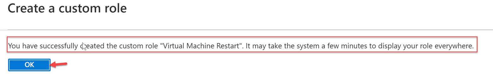

# Create Custom RBAC Role

In the next exercise we will focus on Role-based Access Control (RBAC).

## Before you begin

1. Create a folder on C: named RBAC: Example: C:\RBAC

2. Download the following file and save it in C:\RBAC.
[VirtualMachineRestart.json](https://raw.githubusercontent.com/RichShillingtonMSFT/Azure-Stack-Hub-Operator-Labs-ADFS/main/07-Role%20Based%20Access%20Control/VirtualMachineRestart.json)

## Create the Custome RBAC Role.

1. Open the **Azure Stack User Portal**

2. Click on All Services, Subscriptions then click on the Development Subscription.

3. Click Access Control (IAM), then Roles. Notice the built-in roles currently available.

4. Click Add, then Add Custom Role.

5. Select Start from JSON then click on the file browser icon.

6. Browse to **C:\LabFiles\07-Role Based Access Control **and select** VirtualMachineRestart.json**, then click **Open**.

7. Click Next.

8. Review the permissions imported from the JSON file, then click Next.

9. Click Add assignable scopes.

10. Select your Development Subscription, then click Add.

11. Click **Review + Create** , then **Create**.

12. Click Ok on the success popup.

13. You can now see and assign the custom role you created.

