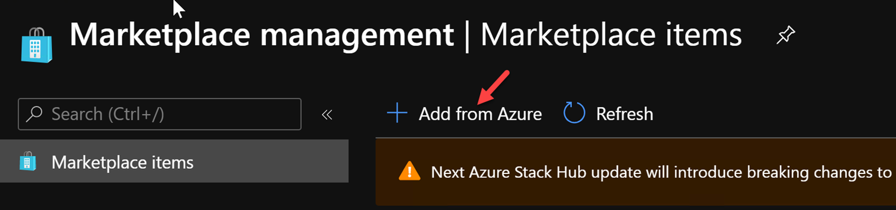

# Download Marketplace Items

The Azure Stack Hub Marketplace is a collection of services, apps, and resources customized for Azure Stack Hub. Resources include networks, virtual machines (VMs), storage, and more. Use Azure Stack Hub Marketplace to create new resources and deploy new apps or browse and choose the items you want to use. To use a marketplace item, users must subscribe to an offer that grants them access to that item.

As an Azure Stack Hub operator, you decide which items to add (publish) to Azure Stack Hub Marketplace. You can publish items such as databases, app services, and more. Publishing makes items visible to all your users. You can publish custom items that you create, or you can publish items from a growing list of Azure Marketplace items. When you publish an item to Azure Stack Hub Marketplace, users can see it within five minutes.

## Download Marketplace Items (Online)

If you have performed an online registration, you will have the ability to download Marketplace items directly from Azure to your Azure Stack Hub Marketplace.

1. Sign into the Admin Portal and select Marketplace Management from the favorites blade.


2. Select Add from Azure.



3. Search or browse for **[smalldisk] Windows Server 2016 Datacenter-Bring your own license**, then select it.


4. Notice you can select from multiple versions. Click on **Download**.


5. Go back to Marketplace Management. Check the status of the download. When the download is complete, it will become available for all users.


## Offline Marketplace Syndication

When Azure Stack Hub has limited or no internet connectivity, you use PowerShell and the marketplace syndication tool to download the marketplace items to a machine with internet connectivity. You then transfer the items to your Azure Stack Hub environment. In a disconnected environment, you can't download marketplace items by using the Azure Stack Hub portal.

1. On your ASDK, create a folder named **MarketplaceItems** on the C: Drive. **C:\MarketplaceItems**


2. Open a NEW elevated PowerShell window and run:

```
Install-Module -Name Azs.Syndication.Admin -Force
```


3. Connect to our **Azure hyperscale** subscription using PowerShell. When prompted, sign in with your **StudentXX@azurestacktraining.com** account.

```
Connect-AzAccount -Environment 'AzureCloud' -Tenant 'azurestacktraining.com'
```


**NOTE**: If you have multiple Azure Subscription, you will need to set the context to the subscription where your Azure Stack Hub is registered.
```
Get-AzSubscription -SubscriptionID 'Your Azure Subscription GUID' | Select-AzSubscription
```

4. To select the products to download run:

```
$products = Select-AzsMarketplaceItem
```


5. Select your Azure Stack Registration resource, then click Ok. For this lab you can pick any object.


6. Browse or search for **[smalldisk] Windows Server 2019 Datacenter-Bring your own license**, then click Ok.


**NOTE**: You could select multiple items by holding Cntrl.


7. To start the download, run:

```
$products | Export-AzsMarketplaceItem -RepositoryDir "C:\MarketplaceItems"
```


**You will need to answer Y to accept the license agreement.**

8. Wait for your download to complete.


**NOTE**: At this point, you would move the items in C:\MarketplaceItems to a workstation that has access to your disconnected Azure Stack Hub environment.


9. Open a **NEW** PowerShell window and connect to the **AzS-Admin Environment**.


10. In PowerShell, begin the import of your downloaded item by running:

```
Import-AzsMarketplaceItem -RepositoryDir "C:\MarketplaceItems\"
```

11. Once your upload it complete, refresh Marketplace Management in the Admin Portal and verify that your Marketplace items are available.

