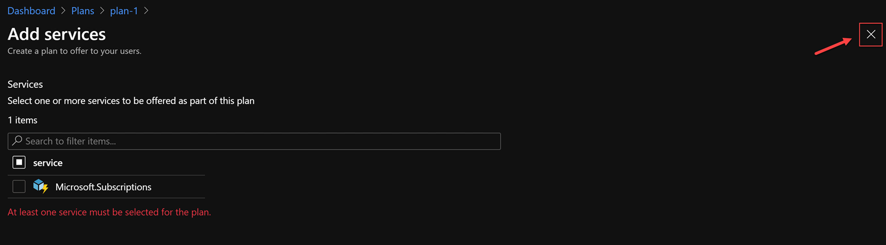

# Resolve the Key Vault Error

When you created the Subscription, you chose to use Offer 1 for the subscription. Offer 1 included Plan 1.

Plan 1 included only the following services.


You will notice that the KeyVault service was not selected. Subscriptions can only deploy resources that are included in their offers & plans.

Fix the Plan

1. Open the Azure Stack Admin Portal.


2. Navigate to Plans and click on Plan 1.


3. In the plan settings, click on Services and quotas.


4. Click Add


5. Select Microsoft.KeyVault and click Add.


6. Select the Unlimited quota, then click Add.


7. Close the Plan settings by clicking the X.




8. Go back to your open AzS-User PowerShell and register the resource provider in the subscription.

```
Register-AzResourceProvider -ProviderNamespace Microsoft.KeyVault
```


9. Wait for the Resource Provider to complete registration. You can check the status by running:

```
(Get-AzResourceProvider -ProviderNamespace Microsoft.KeyVault).RegistrationState
```

Once it is registered you can continue with the lab.