# Use Key Vault to Deploy a VM

You have already learned that Key Vault can be used to store secrets. You can also use Key Vault to store passwords for virtual machines and allow Azure Resource Manager to retrieve the passwords during deployment.

## Create a Key Vault and Add a Secret

For this lab we will create a new Key Vault in the Azure Stack User Portal. We will then configure an ARM Template parameters file to retrieve the VMs local Admin password from Key Vault during the deployment process.

1. Open a PowerShell window and connect to **AzS-User Environment**.

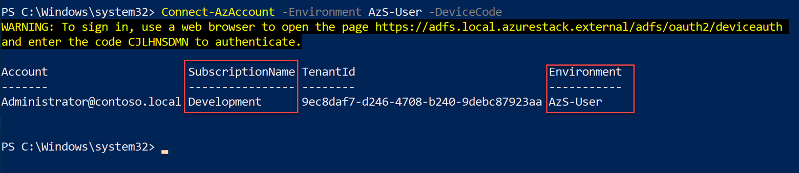


2. In PowerShell create the following variables:

```
$VaultName = "MyKeyVault"

$ResourceGroupName = "MyKeyVault-RG"

$location = "local"

$SecretName = "MySecret"
```

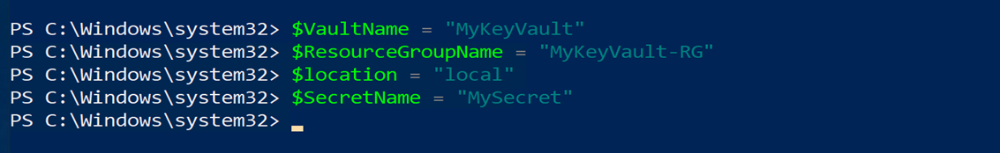

3. Create a new Resource Group:

```
$ResourceGroup = New-AzResourceGroup -Name $ResourceGroupName -Location $location
```

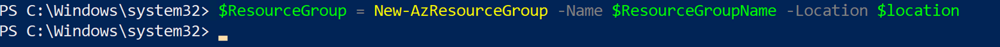


4. Create a new Key Vault:

```
$Keyvault = New-AzKeyVault -VaultName $VaultName -ResourceGroupName $ResourceGroup.ResourceGroupName -Location $ResourceGroup.Location -EnabledForTemplateDeployment
```

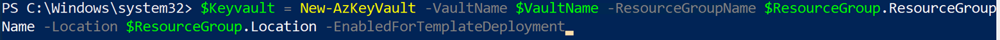


5. You should have received an error while deploying Key vault in your User Subscription.

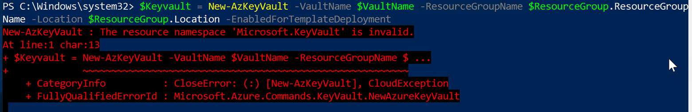

Review the text of the error and determine what may have caused the Key Vault service to fail and not be valid for this subscription.

<span style="color:red">New-AzKeyVault : The resource namespace 'Microsoft.KeyVault' is invalid.</span>


6. Once you have fixed the issue you can retry the command to create the Key Vault.

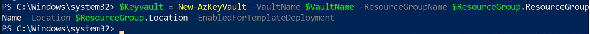

7. Once complete, get and make note of the Resource ID of the Key Vault:

```
$Keyvault.ResourceId
```

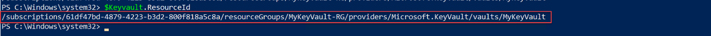

8. Create a Password variable:

```
$SecretValue = ConvertTo-SecureString -String 'Test1234!@#$' -AsPlainText -Force
```


9. Add the Secret to Key Vault:

```
Set-AzKeyVaultSecret -VaultName $Keyvault.VaultName -Name $SecretName -SecretValue $SecretValue
```


10. You should have run in to another error. Review the error details and see if you can determine what is preventing you from adding the secret to the Key vault.

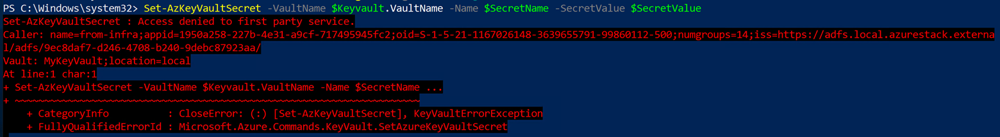

<span style="color:red">Set-AzKeyVaultSecret : Access denied to first party service.</span>

**HINT:** Check step 6 in LabFiles\05-Privileged Endpoint\02 - Create a Key Vault to Store CloudAdmin Credentials.pdf


11. Once you have resolved the issue, you can rerun the command to set the secret.

```
Set-AzKeyVaultSecret -VaultName $Keyvault.VaultName -Name $SecretName -SecretValue $SecretValue
```

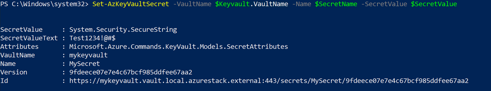

## Setup the ARM template and deploy the VM

Now that we have a Key vault and our local password saved in a secret, we need to reference the key vault and secret in our ARM Template.

1. Browse to C:\LabFiles\09-Virtual Machines\01 - VM Creation with KeyVault\101-vm-windows-create\ and open azuredeploy.parameters.json with VSCode.


2. Replace the ID with your Key Vault Resource ID you documented earlier and the Secret Name you created. Save and close the file.

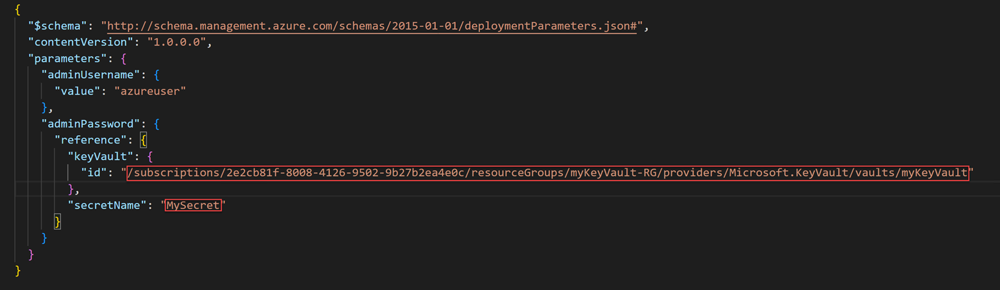


3. In your PowerShell connected to AzS-User, create the following variables:

```
$ResourceGroupName = 'VM-Rg'

$TemplateFile = 'C:\LabFiles\09-Virtual Machines\01 - VM Creation with KeyVault\101-vm-windows-create\azuredeploy.json'

$TemplateParameterFile = 'C:\LabFiles\09-Virtual Machines\01 - VM Creation with KeyVault\101-vm-windows-create\azuredeploy.parameters.json'

```

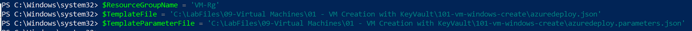

4. Create a Resource Group for the VM:

```
$ResourceGroup = New-AzResourceGroup -Name $ResourceGroupName -Location $location
```

5. Deploy the VM:

```
New-AzResourceGroupDeployment -Name 'VMDeploy' -ResourceGroupName $ResourceGroup.ResourceGroupName -TemplateFile $TemplateFile -TemplateParameterFile $TemplateParameterFile
```

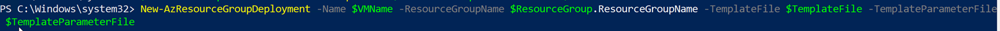

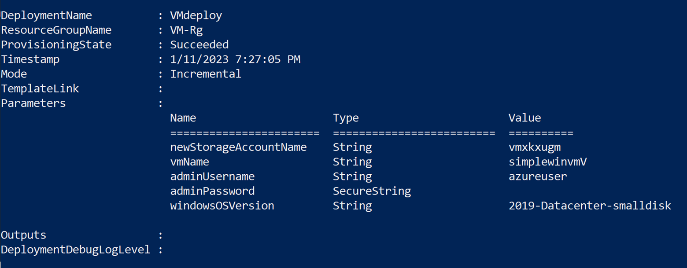

6. Once the deployment is complete, go to the Azure Stack User Portal and navigate to the Virtual machines blade.


7. Click on the VM you just deployed. Notice that the VM does not have a Public IP. You will need to add one to connect to the VM from outside of the Virtual Network. Click on Networking.

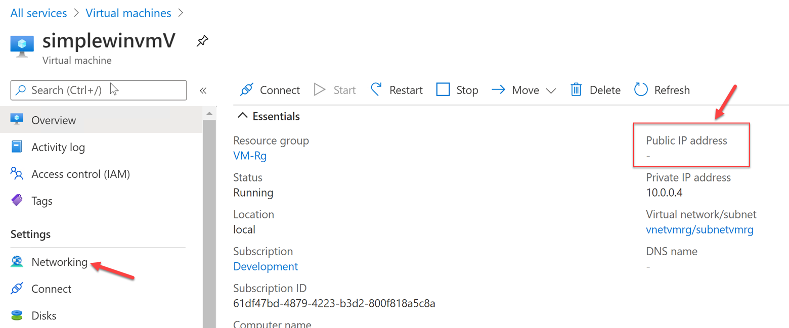


8. Click on the Network Interface.

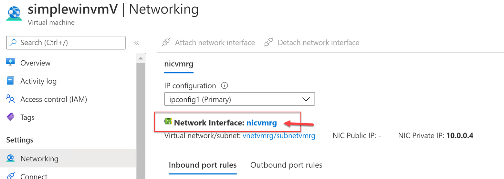

9. Click on the IP Configuration.

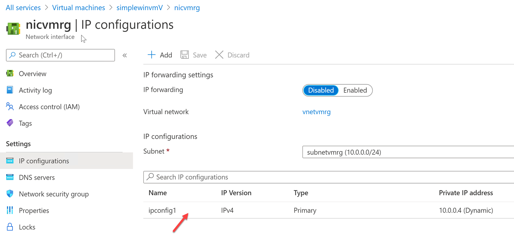

10. Click on Associate to add a Public IP and Configure Required Settings.

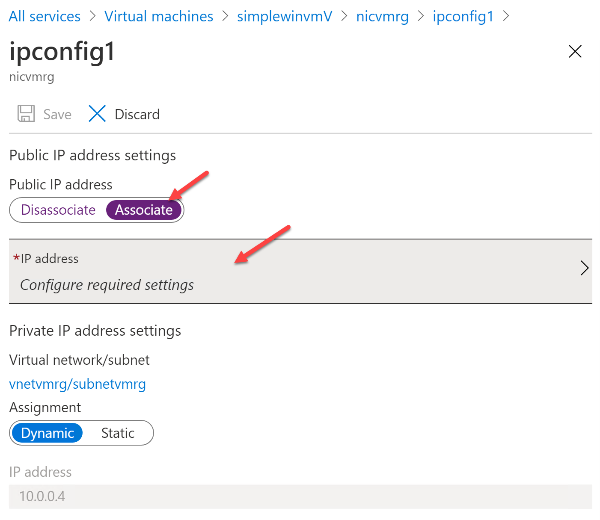

11. Click on Create New.

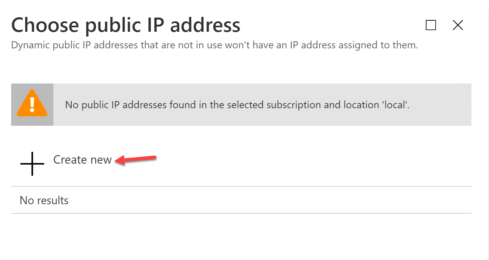


12. Give the Public IP a Name, Choose either Dynamic or Static, then click Ok.

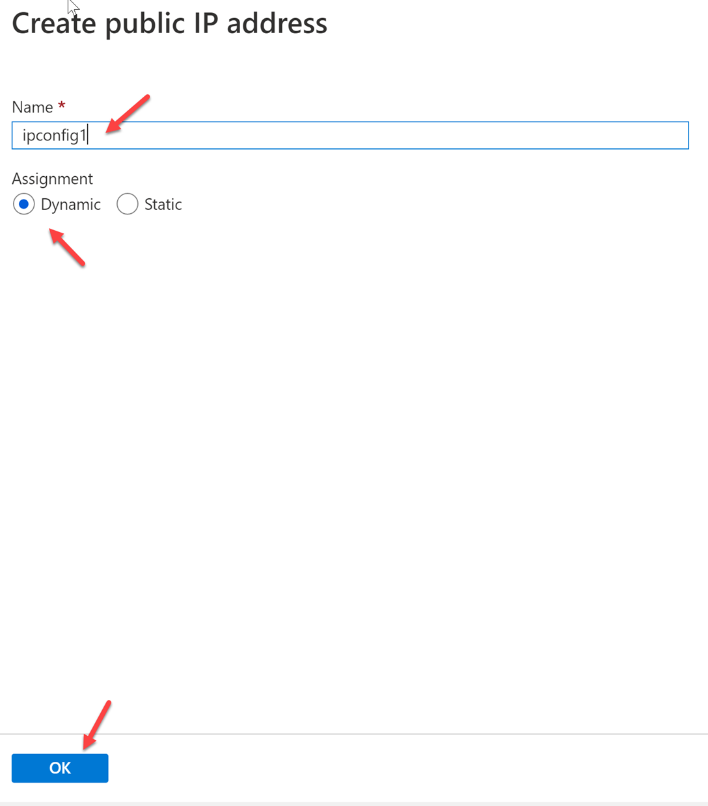

13. Click on Save and wait for completion.

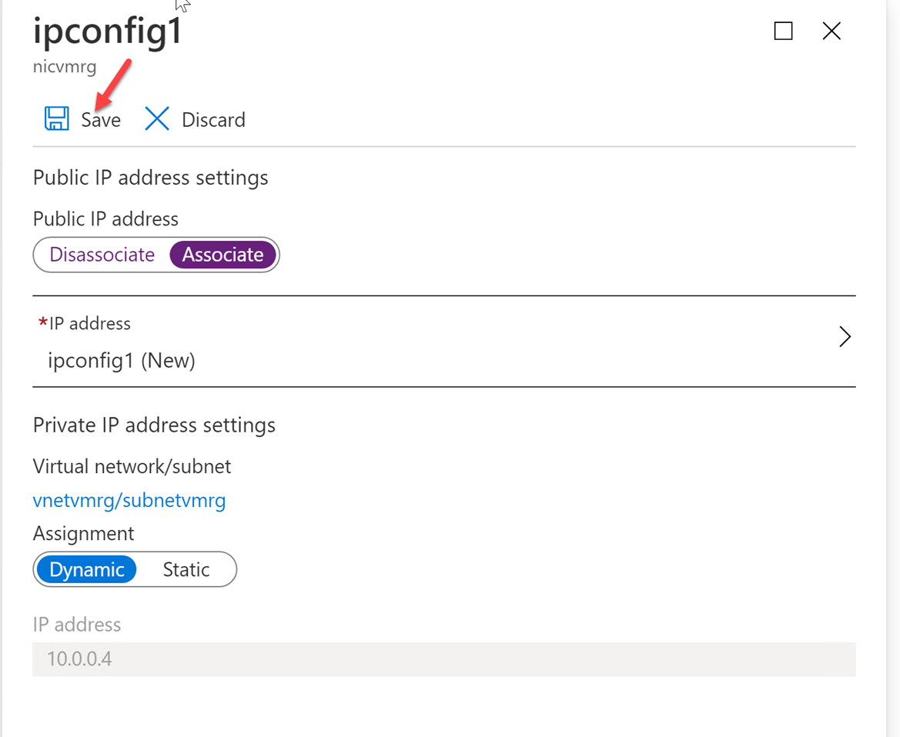


14. Once complete, go back to the Virtual Machines screen and click on the VM. Note the Public IP that is now associated with the VM.

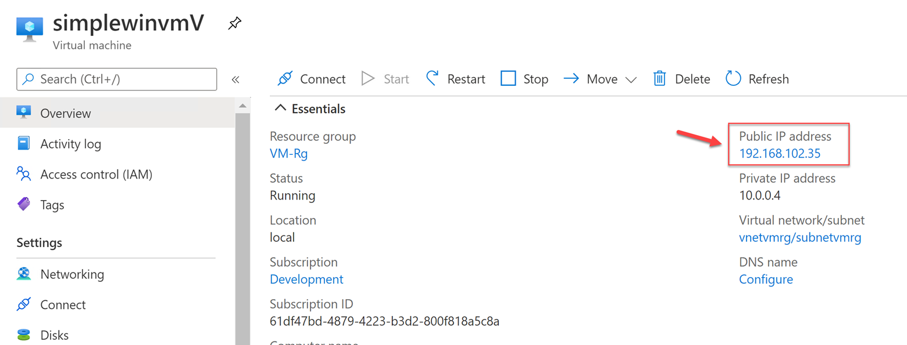


15. Open RDP and connect to the VM by the Public IP. Login with the username **azureuser** and the password we used for the Key Vault secret.