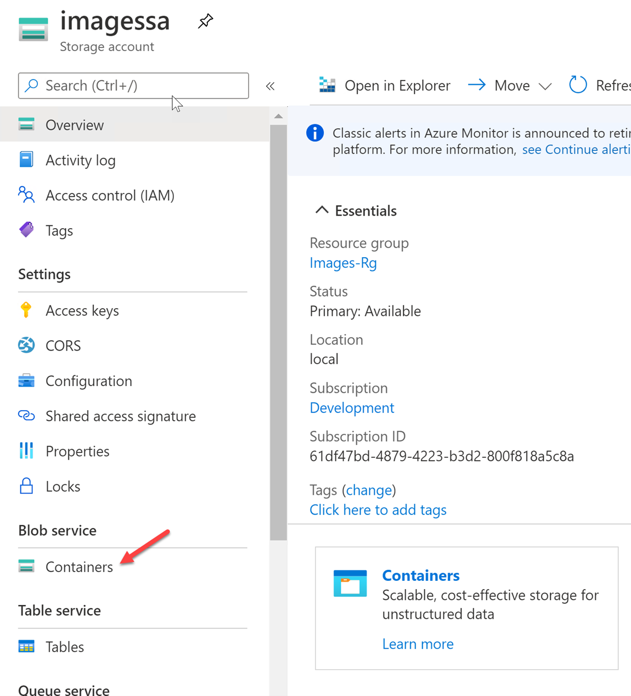
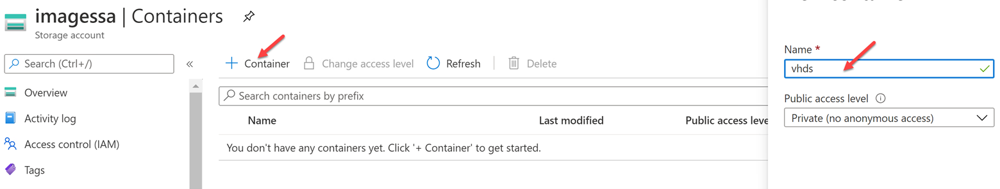

# Create a Custom Image User Tenant

There are multiple ways to add an image that can be used by the Azure Stack Hub users. In the next exercises we will explore these options.

## Add a Custom Image in the User Portal

Each subscription has the ability to create their own images they can use for deployment.

1. Open the Azure Stack Hub User Portal.


2. Create a Resource Group called **Images-Rg**


3. Search or browse for Storage Accounts.


1. Click Add to create a new Storage Account.


5. Select **Images-Rg** for the Resource Group and name the storage account **imagessa**


6. Click **Review + Create,** then **Create.**


7. When the deployment is complete, click on Go to Resource.


8. In the Storage Account blade, under Blob service, click on Containers.




9. Click on + to add a new Container. For the Container name use vhds, then click Create.




10. In order to programmatically connect to the container we need to create a Share Access Signature (SAS) Token. Click on Shared Access Signature.


11. Make sure **all the access boxes are selected**. Change the **expiration date** to a week from today then click **Generate SAS and connection string**.


12. Copy and make note of both the SAS Token and the Blob service SAS Url.


13. Modify your Blob service URL to include the container name. After the / and before the ?, add vhds.


14. You will use AzCopy to upload a prepared VHD to the container. In PowerShell, create two variables.
 The $Source variable should point to the 2019Server.vhd.

```
$Source = 'C:\LabFiles\2019Server.vhd'
```

The $Destination variable must include the modified Blob Service SAS URL you created in the previous step.

```
$Destination = 'https://imagessa.blob.local.azurestack.external/vhds?sv=2019-02-02&ss=bqt&srt=sco&sp=rwdlacup&se=2023-01-21T04:10:34Z&st=2023-01-11T20:10:34Z&spr=https&sig=S%2BgAklby7WTjAG8FvbgXyF2SlHldW8jooUWcDZN8zSU%3D'
```


15. AzCopy uses Azure HyperScale API versions by default. In order for it to work with Azure Stack Hub, you must specify the API version for AzCopy to use. In PowerShell, run the following command to set the API version to one compatible with Azure Stack hub.

```
$env:AZCOPY_DEFAULT_SERVICE_API_VERSION="2017-11-09"
```


16. Now use AzCopy to upload the VHD file to your container.

```
azcopy copy $Source $Destination
```


17. Once the copy is complete, go back to your Azure Stack User Portal, click on All Services, then Images.


18. Click on + Add or Create Image.


19. For the Resource Group us the existing RG, Images-Rg. For the Name, use 2019Server. Select Windows for the OS Type. Click Browse and browse to the 2019Server.vhd in the Storage Account Container we created earlier. For Account type, choose either Standard or Premium.


20. Click Review + Create, then Create.

21. Once the deployment is complete, click Go To Resource.


## Create a VM from a User Portal Image

Now that we have created an image in our User Portal, any users with access to the image can deploy a Virtual Machine from it.

1. In the Image Overview page, click on + Create VM


2. Ensure that you create a NEW Resource Group for your VM so we can delete it after without deleting our Image. Fill out all the required fields and complete the VM deployment. Feel free to explore each option and change anything you would like. Just be sure that everything is in the same Resource Group.


3. Once the VM deployment is complete, go to the Virtual Machine and explore the different properties.