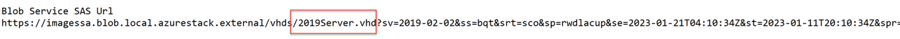
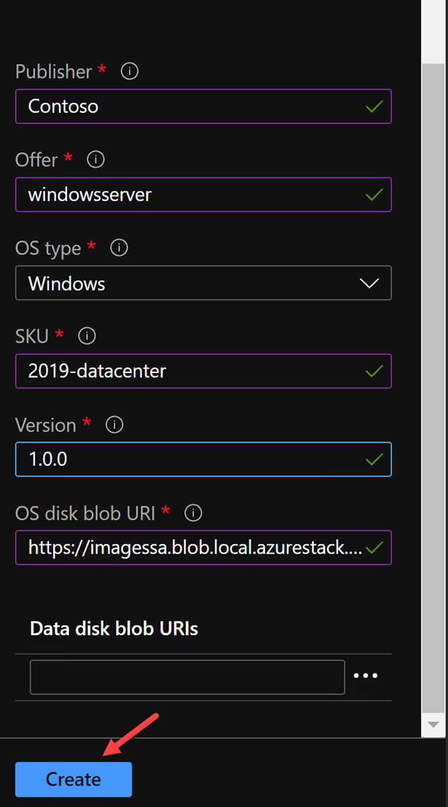
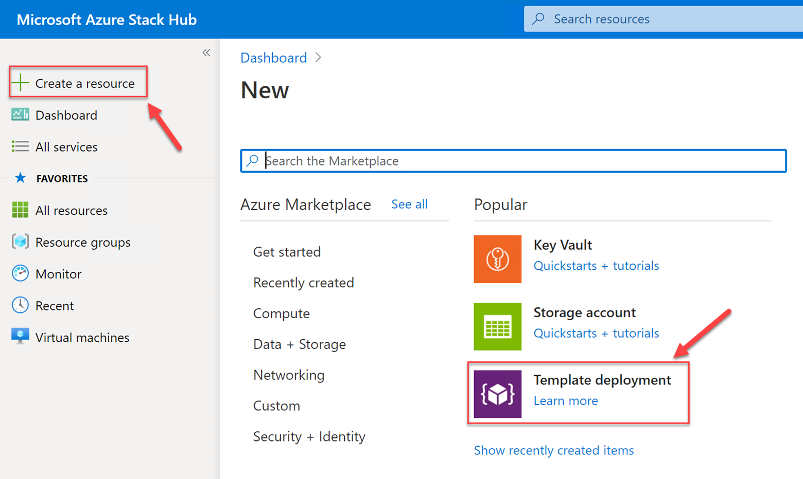
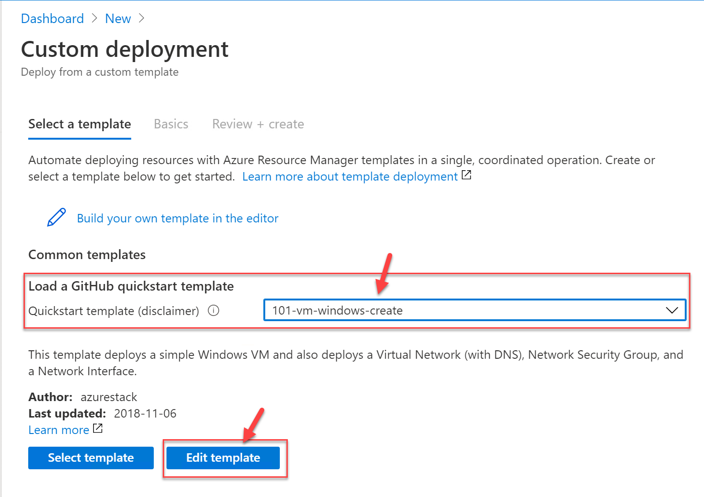
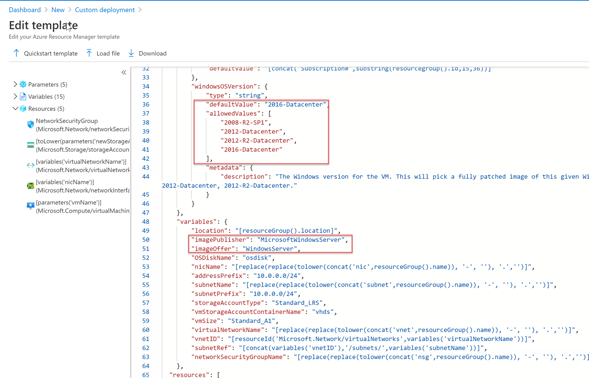
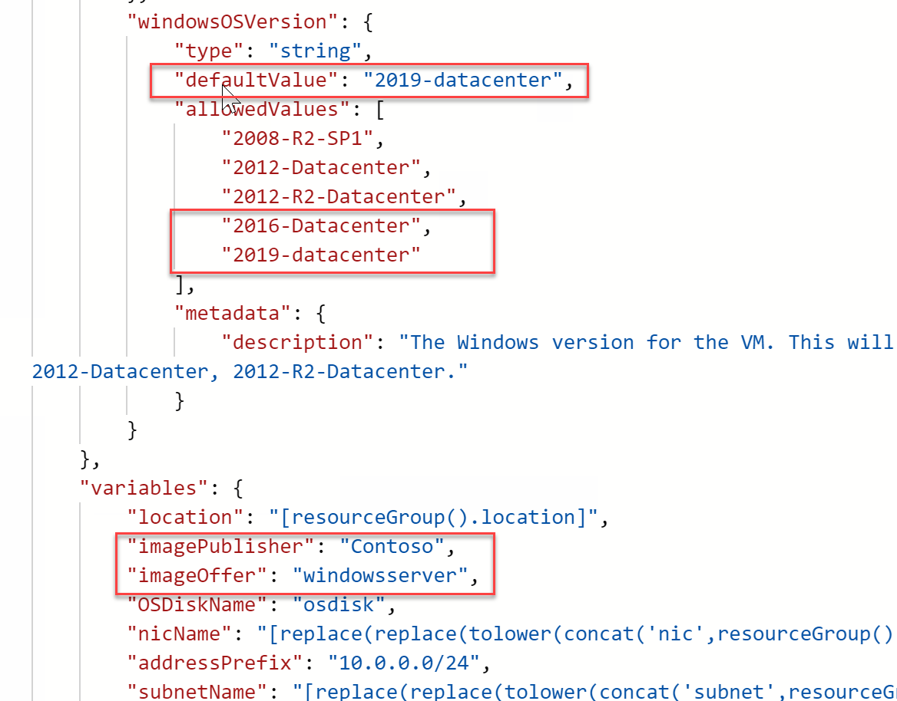

# Create Image - Operator

You have already created an image in the User Tenant. This type of image while useful in some cases, has limits. It can only be deployed within the subscription where it is hosted. It cannot be deployed easily with ARM templates, and it would be hard to maintain these at scale.
 As an Operator, you can create an image that can be used by every tenant.

## Upload Custom Image as an Operator

In our last image lab, we uploaded a VHD to a storage account on the User Tenant side. We could upload a VHD to a Storage Account on the operator side, but to save time we will use that VHD as our source.

1. Sign in to the Azure Stack Hub Admin Portal

2. Click on Region Management, select Compute, click on VM Images, then select Add.

3. When adding the image, you will need to provide several parameters. Publisher, Offer, OS Type, SKU, Version and OS Disk Blob URL. Use the table below to complete these parameters.

| Publisher | Contoso |
| --- | --- |
| Offer | windowsserver |
| OS Type | Windows |
| SKU | 2019-datacenter |
| Version | 1.0.0 |

For the OS Disk Blob URL you will need to modify the Blob SAS URL you created in our prior image lab to add the vhd.

4. Click Create once you have filled out the required fields.

5. The image creation process will take some time. Wait until you see the image Succeeded prior to continuing on.

## Deploy a VM from an Operator Image

Now that our Image is created on the Operator side, all User tenants can deploy this image using ARM Templates.

1. Login to the Azure Stack User Portal.

2. Click on Create a resource, then Template Deployment.

3. Select 101-vm-windows-create from the Templates dropdown, then select Edit template.

4. ARM uses properties to determine what to deploy. When you added the image on the Operator side, you gave the image properties such as Publisher, Offer, SKU and Version. In order for our ARM template to deploy that specific image, our properties must match.

You will need to edit the Parameters for the windowsOSVersion to ALLOW for and use our SKU and also modify the imagePublisher & imageOffer variables.

It should look like this when complete.

5. Once complete, click Save. The proceed to fill out the required fields and deploy your VM.