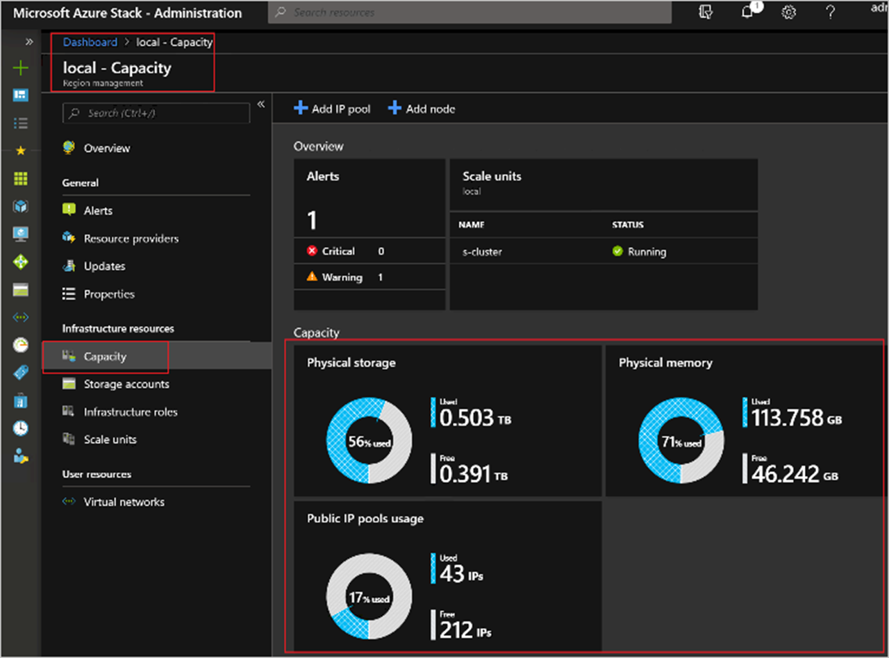
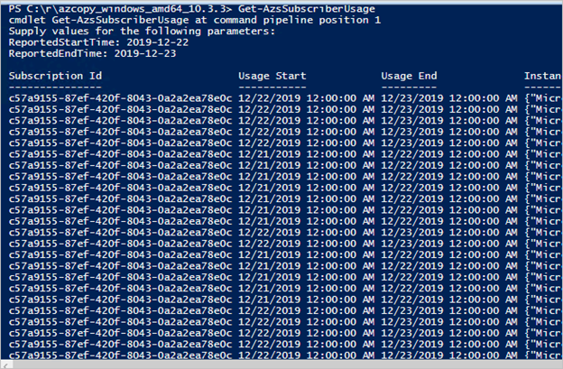

# Capacity Management and Usage Reporting

Using quotas, plans, and offers, the Operator is building a capacity management practice by balancing what is available to the users, while in the same time needs to ensure enough capacity is present for future workloads. In the next exercise we will:

- Using the Capacity blade
- Using the usage database to pull information regarding used capacity

## The Capacity blade

Open the **Azure Stack Admin Portal** link and login using  **administrator@contoso.local**. Browse to the Region Management blade and open the Capacity tab.



Notice the available information on the capacity available in the ASDK and how only Public IP pools can be added. On an actual Azure Stack Hub you would see something similar to the picture above, however an ASDK will not display the capacity statistics.

## Usage reporting

1. On the ASDK, open PowerShell and connect to **AzS-Admin Environment**

2. Login using the **administrator@contoso.local** and respective password

3. Run **Get-AzsSubscriberUsage** and provide the reported start time as yyyy-mm-dd (yesterday) and ReportedEndTime as yyyy-mm-dd (tomorrow)

Example: Get-AzsSubscriberUsage -ReportedStartTime 2023-01-01 -ReportedEndTime 2023-01-12



[!Note] as you can see, this is hard to understand how usage is generated and which tenant/user-subscription consumes what. To help with this, we have a powershell script (usagesummary.ps1) in the AzureStack Tools, which creates a CSV file that can easily be converted in Excel and used to generate reports and such.

To use the UsageSummary,

```
Set-Location "$ENV:ProgramFiles\WindowsPowerShell\Modules\AzureStack-Tools-az\Usage"
```

```
.\Usagesummary.ps1 -StartTime 2021-10-19 -EndTime 2021-10-20 -CsvFile $env:USERPROFILE\Documents\Usage.csv
```

**NOTE**: Check your Documents directory and you will find Usage.csv. Open this file with excel.