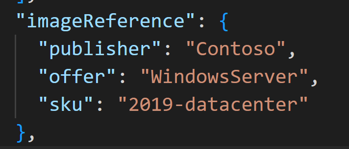
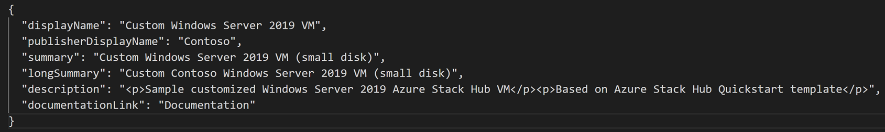
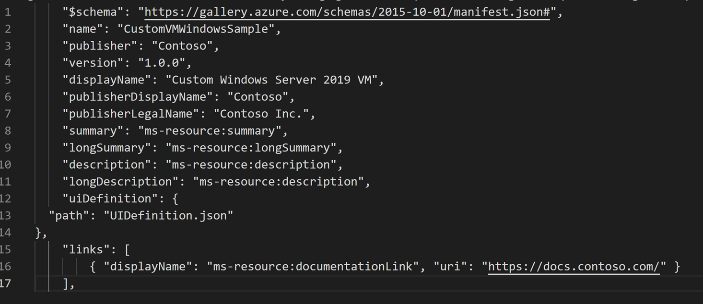

# Add & Remove custom Marketplace Items by using the Azure Gallery Packager

You are an operator of an Azure Stack Hub environment. You need to create custom Azure Stack Marketplace items using the Azure Gallery Packager tool.

## Modify an existing Azure Gallery Packager package

Thing In this task, you will modify an existing Azure Gallery Packager package, such that it will use the Windows Server 2019 image you created in an earlier lab (rather than Windows Server 2016)

1. On your ASDK, open a web browser window, navigate to the [Azure Gallery Packager tool download page](https://aka.ms/azsmarketplaceitem) and download the Microsoft Azure Stack Gallery Packaging Tool and Sample 3.0.zip archive file to the Downloads folder.


2. Once the download completes, extract the Packager folder within the zip file into the C:\Downloads folder (create the folder if needed).


3. File Explorer, navigate to the C:\Downloads\Packager\Samples for Packager folder, copy the Sample.SingleVMWindowsSample.1.0.0.azpkg package to the C:\Downloads folder, and rename its extension to .zip.


4. Extract the content of the **Sample.SingleVMWindowsSample.1.0.0.zip** archive to the C:\Downloads\SamplePackage folder (you will need to create it first).


5. In File Explorer, navigate to the C:\Downloads\SamplePackage\DeploymentTemplates folder and open the createuidefinition.json file in VSCode.


6. Modify the properties in the imageReference section of the file such that it references the Windows Server image you created in the previous lab.



7. Save the changes and close the file.

8. In File Explorer, navigate to the C:\Downloads\SamplePackage\strings folder and open the resources.resjson file in VSCode.

- Modify the content of the resources.resjson file by setting the following values in the key-value pairs :
  - displayName: Custom Windows Server 2019 VM
  - publisherDisplayName: Contoso
  - summary: Custom Windows Server 2019 VM (small disk)
  - longSummary: Custom Contoso Windows Server 2019 VM (small disk)
  - description: Sample customized Windows Server 2019 Azure Stack Hub VM



9. Save the changes and close the file.


10. In File Explorer, navigate to the C:\Downloads\SamplePackage folder and open the manifest.json file in VSCode.

11. Modify the content of the manifest.json file by setting the following values in the key-value pairs :

name: CustomVMWindowsSample

publisher: Contoso

version: 1.0.0

displayName: Custom Windows Server 2019 VM

publisherDisplayName: Contoso

publisherLegalName: Contoso Inc.

Note: This should yield the following content (starting with the line 2 of the file):



12. Save and close the file.

## Generate the customized Azure Gallery Packager package

In this task, you will regenerate the newly customized Azure Gallery Packager package.

1. **From the Command Prompt**, run the following to change the current directory:

```
cd C:\Downloads\Packager
```

2. From the Command Prompt, run the following to generate a new package based on the content you modified in the previous task:

```
AzureStackHubGallery.exe package -m C:\Downloads\SamplePackage\manifest.json -o C:\Downloads\
```

3. Verify that the Contoso.CustomVMWindowsSample.1.0.0.azpkg package was automatically saved to the C:\Downloads folder.


## Upload the package to an Azure Stack Hub storage account

In this task, Upload the Azure Stack Hub Marketplace item package to an Azure Stack Hub storage account.

1. Open the Azure Stack Hub administrator portal, click + Create a resource.


2. On the New page, click Data + Storage.


3. On the Data + Storage page, click Storage account.


4. On the Basics tab of the Create storage account page, specify the following settings:

- Subscription: Default Provider Subscription
- Resource group: the name of a new resource group marketplace-pkgs-RG
- Name: a unique name consisting of between 3 and 24 lower case letters or digits
- Location: local
- Performance: Standard
- Account kind: Storage (general purpose v1)
- Replication: Locally-redundant storage (LRS)


5. On the Basics tab of the Create storage account page, click Next: Advanced.


6. On the Advanced tab of the Create storage account page, leave the default settings in place and click Review + create.


7. On the Review + create tab of the Create storage account page, click Create.

**Note**: Wait until the storage account is provisioned. This should take about one minute.


8. In the web browser window displaying the Azure Stack Hub administrator portal, in the hub menu, select Resource groups.


9. On the Resource group page, in the list of resource groups, click the marketplace-pkgs-RG entry.


10. On the marketplace-pkgs-RG page, click the entry representing the newly created storage account.


11. On the storage account page, click Containers.


12. On the Containers page, click + Container.


13. On the New container page, in the Name textbox, type gallerypackages, in the Public access level drop down list, select Blob (anonymous read access for blobs only), and click Create.


14. Back on the Containers page, click the gallerypackages entry representing the newly created container.


15. On the gallerypackages page, click Upload.


16. On the Upload blob page, click the folder icon next to the Select a file text box.


17. In the Open dialog box, navigate to the C:\Downloads folder, select the Contoso.CustomVMWindowsSample.1.0.0.azpkg package file and click Open.


18. Back on the Upload blob page, click Upload.

## Publish the package to Azure Stack Hub Marketplace

In this task, you will Publish the package to Azure Stack Hub Marketplace.

1. Open an elevated PowerShell window.


2. Connect to the AzS-Admin environment.


3. Run the following to publish the package to Azure Stack Hub Marketplace (where the <storage_account_name> placeholder represents the name of the storage account you assigned in the previous task):

```
Add-AzsGalleryItem -GalleryItemUri 'https://<storage_account_name>.blob.local.azurestack.external/gallerypackages/Contoso.CustomVMWindowsSample.1.0.0.azpkg' -Verbose
```

4. Review the output of the Add-AzsGalleryItem command to verify that the command completes successfully.


## Verify availability of the published Azure Stack Hub Marketplace item

In this task, you will verify the item you just published in the Azure Stack Hub Marketplace is available.

1. In the Azure Stack Hub User portal, click + Create a Resource


2. Click on Compute and locate your Marketplace item.


3. Follow the prompts to deploy your VM.


## Remove custom Marketplace items

In this task, you will verify the item you just published in the Azure Stack Hub Marketplace is available.

1. Open an elevated PowerShell and connect to the AzS-Admin environment.

2. Run **Get-AzSGalleryItem** and see if you can locate the custom package you created.


3. When you have located it, copy the Name property and use the following command to remove it.

```
Remove-AzsGalleryItem -Name <Gallery package name> -Verbose
```