# Prepare an Azure Stack Hub Update

In a connected environment, Azure Stack Hub updates will automatically appear in the Admin portal. In a disconnected environment, the operator must download the updates on an internet connected computer and stage them for installation on the Azure Stack Hub.

## Obtaining Full updates for a disconnected system

Azure Stack Hub full updates must be downloaded using the Update Downloader tool.

1. Download the Azure Stack Hub update download tool [https://aka.ms/azurestackupdatedownload](https://aka.ms/azurestackupdatedownload)

2. Create a folder C:\Updates.

3. Run the update download tool. Select Azure Stack 2206 Update. Click browse to save the download to C:\Updates, then click Download.

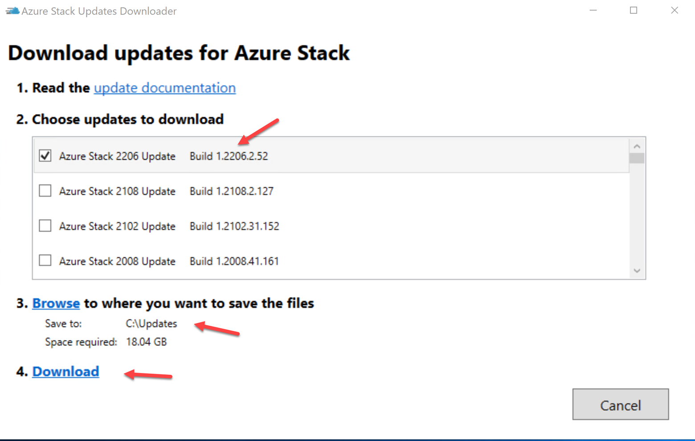

4. Full Azure Stack Hub updates are very large and will take some time.

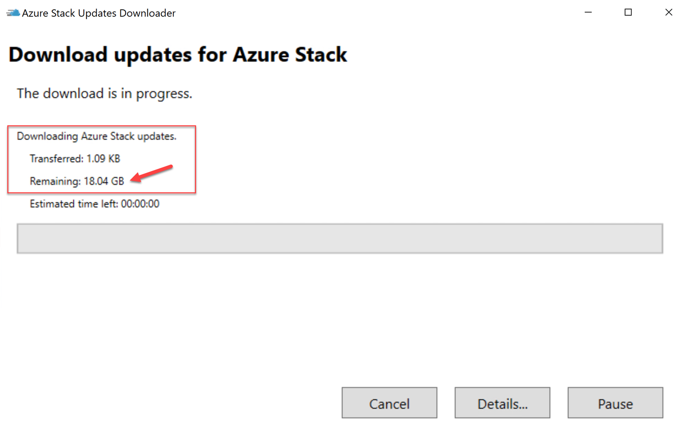

## Obtaining hotfixes for a disconnected system

The hotfix you download depends on your current version. Keep in mind that hotfixes are cumulative, so you only need to apply the latest.

1. Connect to the Azure Stack Admin portal and determine the Major version you are running.

2. Navigate to [https://learn.microsoft.com/en-us/azure-stack/operator/release-notes](https://learn.microsoft.com/en-us/azure-stack/operator/release-notes) then use the version selector dropdown above the table of contents on the left to select the appropriate version.

3. In the left navigation pane, click on hotfixes.

4. Locate the most recent hotfix for your version.

5. In C:\Updates create a folder to save the updates in. Example C:\Updates\HF121082130

6. In the hotfix page, locate and click the download links for the .zip & .xml files and save them to the folder you just created.

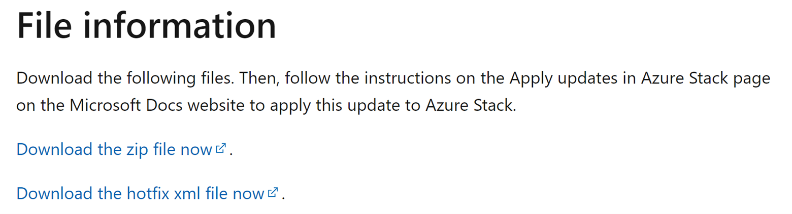

## Upload Hotfixes & Updates to Azure Stack Hub

Once you have moved your updates to a computer that can access Azure Stack Hub, you must upload them to a Storage Account Container in the Azure Stack Hub Admin portal.

1. In the Azure Stack Hub Admin Portal, navigate to Storage Accounts and open updateadminaccount.

2. Create a new container for your hotfix files. Example: hf121082130

3. Click on … and go to the properties of the container. Copy and make note of the URL.

4. Back on the storage account propertied blade, create a Shared Access Signature.

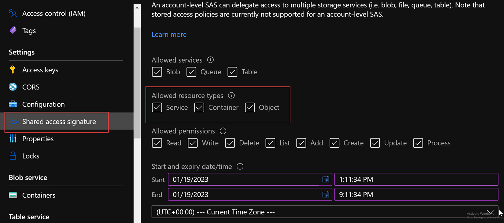

5. Generate the SAS token and copy and note the SAS Token.

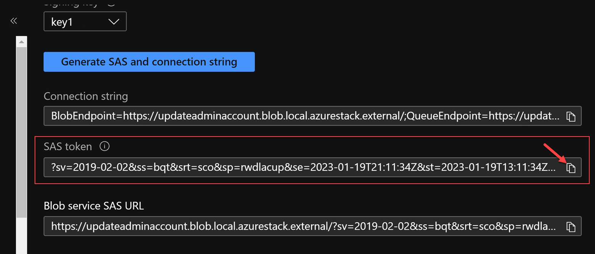

6. In PowerShell create a $Destination variable that combines the updateadminaccount container URL and the SAS Token.

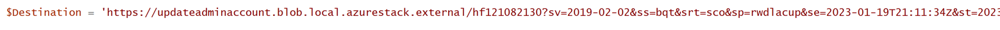

7. As there are multiple files for the Source, we can use the Get-ChildItem command to capture them.

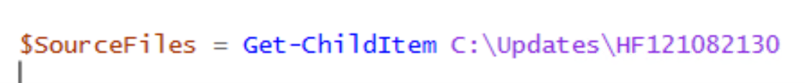

8. Since we are going to use AzCopy on Azure Stack Hub, we must set the API version of AzCopy.

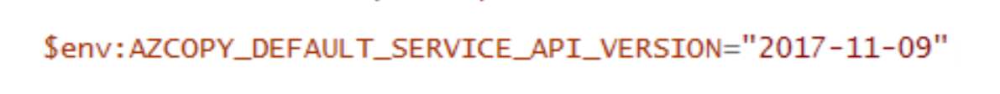

9. Next we can create a Foreach loop in PowerShell to loop through each file and use AzCopy to upload it to our storage account. Notice we are using the .FullName property from the $SourceFile variable created in the Foreach loop.

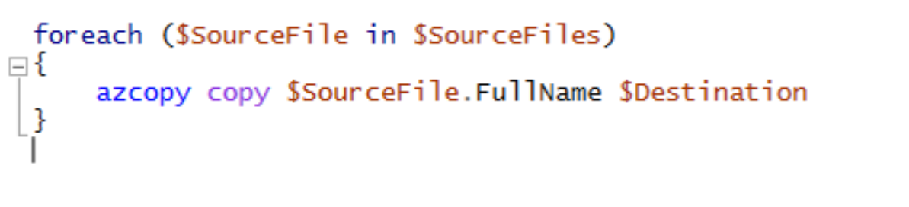

10. Run the full script and check to make sure the uploads completed.

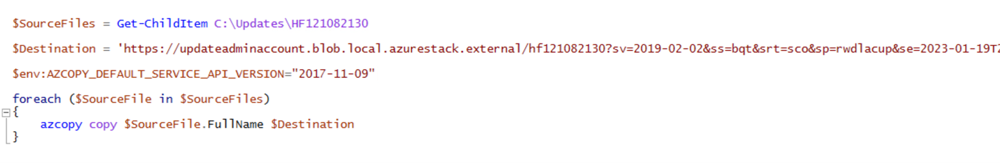

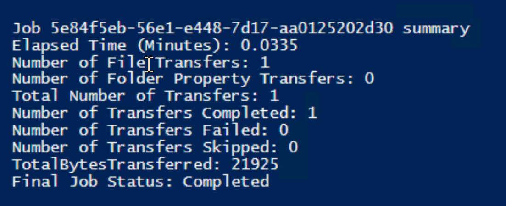

11. In the Azure Stack Admin portal, navigate to the Update blade and you should see your update listed.

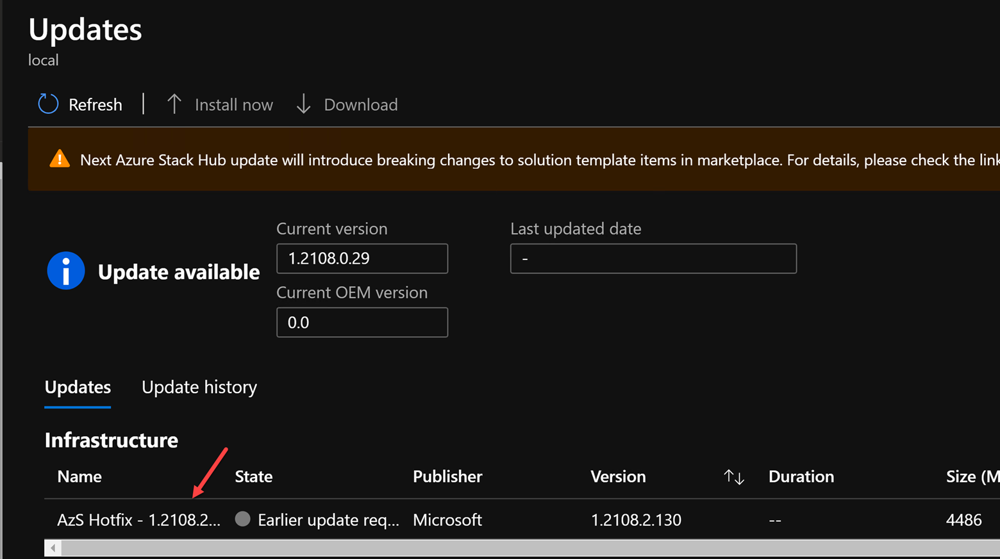