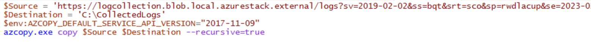

# Diagnostics & Log Collection

In order to diagnose issues, you may to download logs from the Azure Stack Hub infrastructure. Logs can be saved to either a Storage Account or a local file share.

## Create a Storage Account for logs.

In this lab we will create a storage account, a container and a SAS token. You will use this for the next labs as well so be sure to note it.

1. Open the Admin Portal and create a storage account.


2. Create a container in the storage account and make note of the container URL in the properties.


3. Create a SAS token with FULL permissions as done in previous labs. Note the SAS token string.

## Collect logs from the PEP

Now that you have your storage account container URL and SAS Token, we can connect to the PEP and output the logs.

1. Connect to the PEP.


2. Once connected, use invoke-command to run the following command.

```
Get-AzureStackLog -OutputSasUri '<Blob service SAS Uri>'
```
 NOTE: Replace <Blob service SAS Uri> with your Container URL and you SAS Token.

## Analyze the logs

Make sure the log collection finished successfully and the logs are created in the respective storage account. In the next steps we will look at the logs and what type of information is provided – as this is ran in the ASDK, the results themselves aren't relevant, but we ran this to gain familiarity with the operation.

1. Create a folder on C: called CollectedLogs. C:\CollectedLogs


2. Next create a $Destination variable in PowerShell pointing to the folder you just created.

 $Destination = C:\CollectedLogs


3. Create a $Source variable using the Container URL + the SAS Token from the previous task. **The one below is ONLY for reference.**

```
$Source = 'https://logstorage.blob.local.azurestack.external/logs?sv=2019-02-02&ss=bqt&srt=sco&sp=rwdlacup&se=2023-01-1'
```

4. Set the AzCopy API Version

```
$env:AZCOPY\_DEFAULT\_SERVICE\_API\_VERSION="2017-11-09"
```

5. Use AzCopy with the recursive switch to copy all the files from the Storage Account to your C:\CollectedLogs folder.

```
azcopy.exe copy $Source $Destination --recursive=true
```



6. When the copy is complete, open Windows File Explorer and browse to the logs.